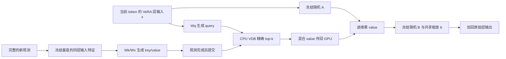

# VeRA-Mem

VeRA-Mem 是基于 **Qwen3-4B-Instruct-2507** 的可写向量记忆研究原型。它从 VeRA 层的实际输入生成逐 token query，在 CPU 向量数据库中稀疏检索 value，并将 value 用作 VeRA 的参数化向量。新观测通过输入特征生成 key/value，写入后供后续查询使用。

主方法扩展了 [VeRA](https://arxiv.org/abs/2310.11454) 的冻结随机矩阵参数化。研究重点是寻址、读出、连续写入与成本的关系；LoRA bank、文本 RAG 和加性 latent reader 属于对照，不能代替主方法的结果。

最新 context-aware 蒸馏尝试已完成：有原文 teacher 在四个开发条件均 **64/64**；五个训练组在新观测表达上均 **0/64**。原观测配新问句时，CE 为 **3/64**，on-KD 为 **4/64**，但后者存在明显输出词偏置，不能认定解决了事实泛化。加入最终 hidden 对齐也未带来稳定改善。结果限于单层、单 seed、短预算的机制实验。

上一轮表述泛化对照中，相同更新预算下，单模板、多模板增强、增强加一致性三组的原模板 EM 为 **100.0% / 24.2% / 33.6%**；保留 XML/CSV/对话问法、原观测 bank 的 EM 为 **0.0% / 4.2% / 3.9%**。后两组打乱 value 后仍为 **4.2% / 3.9%**。历史同模板127/128及全部失败记录均保留；不同数据、预算和初始化的实验不能直接横比。

- [Context-aware 蒸馏结果与后续训练设计](docs/context_distillation_results.md)：五臂真实 Qwen 实验、teacher 验收、逐题诊断、成本及学生交接。
- [最近相关工作](docs/context_distillation_related_work.md)：OPCD、GKD、SADA、Doc-to-LoRA、可检索 LoRA 记忆和 Cartridges 的支持与区别。
- [数据增强与一致性训练结果](docs/generalization_results.md)：三组同预算实验、保留格式四象限、记忆干预对照、表示诊断与学生交接。
- [事实级训练调整](docs/factcentric_training.md)：三组缓存编码器探针；原问句读取两种新观测的 R@1 从 31/64、25/64 提升到 39/64、38/64，新问法仍未解决。这不是生成准确率提升。
- [有上下文 teacher 的蒸馏方案](docs/context_distillation_protocol.md)：冻结原始模型看到观测原文，VDB–VeRA student 仅通过向量读取；分别检验输出蒸馏、最终 hidden 对齐与 on-policy 轨迹，保留明确的寻址监督和记忆干预对照。
- [历史初步实验与失败诊断](docs/pilot_results.md)：保留扩样之前的三轮小样本结果，不能代替最新结论。
- [扩样、初始化与学生交接结论](docs/scaling_results.md)：9 个正式训练/复评运行、数据规模与训练预算对照、冷启动 2×2、当前泛化限制。
- [详细文献与实验设计](docs/literature_and_design.md)：相关工作、机制、预算对照、指标与后续实验计划。
- [数据和无泄漏协议](docs/data_protocol.md)：输入权限、实体划分、先读后写及结论边界。
- [向量参数记忆契约](docs/vector_memory_contract.md)：逐 token VDB–VeRA 读写、稳定版本和扩样/冷启动对照。
- [TTT 训练规模核验](docs/ttt_scaling_review.md)与 [Engram / Qwen 初始化核验](docs/hash_initialization_review.md)：原论文和官方代码支持的设计依据。

## 方法



对选定的 `mlp.down_proj`，令 `x ∈ R^din`，冻结随机矩阵为 `A ∈ R^(r×din)`、`B ∈ R^(dout×r)`：

```text
q = normalize(Wq · norm(x))
vbar = softmax(cosine(q, keys[top_k]) / temperature) · values[top_k]
delta = b ⊙ B[(A x) ⊙ vbar]
output = frozen_projection(x) + delta

key_new = normalize(Wk · norm(support_x))
value_new = tanh(Wv · norm(support_x))
```

中心化诊断将 Wv 的输入改为 `norm(support_x) - mean_offline_train`，均值作为固定 buffer 随 checkpoint 保存。它不改变 Wq/Wk 输入。

新增 `StableVectorVeRA` 分别对 query/support 做训练集中心化后重新 RMS 归一化，value 使用线性投影后的 RMSNorm；它保留同一动态 VeRA 分支。旧 tanh 版本留作诊断对照，不覆盖历史 checkpoint。

`support_x` 来自完整已观察文本在同一层的输入。写入特征提取时关闭记忆增量，保持表示来源稳定。主读取路径在层 hook 内为每个 token 更新 query，prefill 与 decode 都检索；一次回答只固定 VDB 快照，检索结果可以随 token 变化。

**离线训练**在独立实体的 support/query episodes 上学习 `b/Wq/Wk/Wv`，使用查询—证据对比对齐与答案语言模型损失。**在线实验**冻结基座和全部共享参数，仅追加或更新输入生成的向量，不对每条新事实执行共享参数梯度更新。包含揭示答案的观测属于监督写入；本项目不将其称为无监督 test-time training。

当前在线 VDB 的 key/value 实际常驻 CPU，以精确 cosine 搜索得到 top-k 并在 CPU 混合 value。GPU 传入 query、接收混合 rank 向量，没有全量在线 GPU 索引镜像。离线可微训练使用临时 GPU episode 张量。这个实现用于小规模机制验证，不代表大型数据库或低延迟 CPU offload 已经得到验证。

## 安装与测试

需要 Python 3.10+。模型实验入口当前使用单张 CUDA GPU；单元测试不要求下载模型。PyTorch 安装应与目标机器的 CUDA 环境匹配。

推荐将代码与数据、权重、日志分开：

```bash
mkdir -p VeRA-Mem-Workspace
cd VeRA-Mem-Workspace
git clone https://github.com/Concyclics/VeRA-Mem.git
cd VeRA-Mem

python3 -m venv ../env
. ../env/bin/activate
python -m pip install -e '.[test,data]'
python -m pytest -q
```

测试覆盖向量存储的持久化、时间戳更新、只读查询、VeRA 调制与梯度、数据/指标及 backend 接口等契约。测试通过不等于记忆能力成立；后者需要真实模型的对照实验。

## 准备固定版本的模型

从仓库目录执行：

```bash
python scripts/prepare_model.py --workspace ..
```

脚本下载 `Qwen/Qwen3-4B-Instruct-2507`，先将指定 revision（默认当前仓库版本）解析为固定 commit SHA，再按该 SHA 下载运行文件。实际版本、路径和软件包信息写入 `../models/manifest.json`。严格复现时使用其中的 SHA：

```bash
python scripts/prepare_model.py --workspace .. --revision '<已记录的模型 commit SHA>'
```

模型使用官方 tokenizer chat template。脚本下载前检查至少 13 GiB 剩余空间；数据、训练产物与日志还需要额外空间。[官方模型卡](https://huggingface.co/Qwen/Qwen3-4B-Instruct-2507)

## 运行主方法

先检查 GPU 的实际占用，并显式设置已确认可用的设备 UUID。脚本不会为实验终止其他进程。

```bash
nvidia-smi --query-gpu=uuid,name,memory.used,memory.free,utilization.gpu --format=csv
export GPU_UUID='GPU-替换为已确认可用的实际UUID'
```

以下命令运行合成关联任务：离线训练共享读写接口，然后在新的实体上进行在线向量写入，依次评估真实检索、oracle、打乱 value 和空记忆。

```bash
CUDA_VISIBLE_DEVICES="$GPU_UUID" OMP_NUM_THREADS=4 TOKENIZERS_PARALLELISM=false \
python -m vera_mem.vector_run \
  --config configs/vector_pilot.json \
  --model ../models/Qwen3-4B-Instruct-2507 \
  --data ../data/synthetic \
  --output ../runs/example \
  --dataset synthetic
```

合成数据由种子生成，实际使用的样本保存到 run 目录。配置中的 rank、key 维数、top-k、训练量与流长度均应在查看测试结果前固定。输出目录必须不存在，入口会拒绝覆盖已有结果。

`vector_pilot.json` 重现初版联合训练；`vector_centered.json` 重现仅中心化诊断；`vector_staged.json` 先冻结已对齐的 Q/K，再用正确 support 训练 Wv/b。后两者的 `eval_seed` 与训练 `seed` 分离，属于不同在线事实上的诊断，不是独立训练 seed 的确认实验。

四个主条件共用离线 checkpoint，并各自重建在线记忆：

| 条件 | 含义 |
| --- | --- |
| `vdb_real` | 从实际层输入逐 token 查询 CPU VDB |
| `vdb_oracle` | 强制读取已合法写入的正确证据向量；改变读取分布，仅作诊断，不保证准确率上界 |
| `vdb_shuffled` | 保持 key，置换 value，检查模型是否依赖记忆内容 |
| `vdb_empty` | 令记忆增量为零，检查无记忆行为 |

连续流先预测，再接收 support 并写入，然后只读测量立即记忆、旧事实保持、替换问法和未写入控制。原型对照中的 value 置换可能保留相同答案类别，应结合逐题检索记录解释结果。

## 对照与数据集

运行冻结模型、TF-IDF 文本 RAG、文本 oracle 和 LoRA bank 对照：

```bash
CUDA_VISIBLE_DEVICES="$GPU_UUID" OMP_NUM_THREADS=4 TOKENIZERS_PARALLELISM=false \
python -m vera_mem.run \
  --config configs/baselines.json \
  --model ../models/Qwen3-4B-Instruct-2507 \
  --data ../data/synthetic \
  --output ../runs/baseline_example \
  --dataset synthetic
```

LoRA bank 对照会按配置执行监督梯度写入，其更新机制和成本与主方法不同。这里使用 TF-IDF，不将其命名为 BM25。

| 数据 | 当前用途 | 解释范围 |
| --- | --- | --- |
| 种子生成的实体—单词关联 | 主方法和对照的首轮机制实验 | 测试新关联、寻址和保持；有限答案词表不代表任意知识容量 |
| MedMCQA | 已提供下载、固定抽样及运行入口；使用 `--dataset medmcqa` | 有标签领域写入与迁移；无法排除基座预训练暴露 |
| LongMemEval cleaned v1 | 已制定协议，本轮未运行 | 后续真实会话、时间、更新和拒答评测 |
| LoCoMo | 后续外部验证计划 | 需按完整会话划分与统计 |

如需提前准备 MedMCQA：

```bash
python scripts/prepare_data.py --output ../data/medmcqa --seed 42
```

MedMCQA 的具体处理样本以每次运行记录为准。复用已训练的读写接口可向 `vera_mem.vector_run` 传入 `--checkpoint <vector_vera.pt>`；跨数据集使用应标记为迁移实验，并确认层号、rank、key 维数及基座匹配。

`scripts/run_suite.py` 提供串行单 GPU 实验编排，要求显式传入 `--gpu <UUID>`，记录源码快照、日志和退出码；其运行前占用检查不能替代资源预约。单条入口适合先验证环境和配置。

## 扩样与初始化实验

新入口 `vera_mem.scaling_run` 在同一组嵌套的 128/1024/4096 条训练事实和固定评估实体上比较数据规模。主矩阵保持 512 次 batch-8 LM 更新；地址预热 400 次 batch-128 更新另计。`raw` 是旧中心化、oracle reader 配方，`stable` 是中心化/RMS、较低学习率及 oracle→真实检索课程的组合变体。两者不能作为单变量非线性消融解释。

先在已安装依赖的环境、已确认空闲的 GPU 上准备固定特征，再运行 suite。`env_deps` 可为空目录；本次远端将特定 Jinja2 版本单独放在其中：

```bash
mkdir -p ../env_deps
CUDA_VISIBLE_DEVICES="$GPU_UUID" OMP_NUM_THREADS=4 \
python -m vera_mem.scaling_run --prepare-only \
  --model ../models/Qwen3-4B-Instruct-2507 \
  --cache ../data/scaling/features_v1.pt

python scripts/run_scaling_suite.py --workspace .. --gpu "$GPU_UUID" \
  --name scaling_example --profile stable --cache ../data/scaling/features_v1.pt
```

该受控入口要求模型清单的 revision 为 `cdbee75f17c01a7cc42f958dc650907174af0554`。Suite 使用隔离源码快照、`../env_deps` 依赖目录与显式退出码；目录必须预先准备。可选 `raw`、`stable`、`cold`、`extended`、`smoke` profile。`cold` 将 128 条离线训练观测经 writer 编码为初始 VDB，额外执行同 checkpoint 的空库复评；`stable` 也执行同 checkpoint 的有初始库复评，区分训练因素和部署初始化因素。

线上只读评测严格使用冻结共享权重，完成新观测后写入新向量。这里的初始库是训练观测经学习后 writer 生成的快照，不是独立自由训练的 prototype 参数表。Smoke 使用独立的在线实体，不进入主结果表。

## 目录与实验产物

```text
VeRA-Mem-Workspace/
├── VeRA-Mem/                  # 本仓库
│   ├── src/vera_mem/
│   │   ├── vector_vera.py     # 冻结随机矩阵与动态向量调制
│   │   ├── vector_store.py    # CPU 精确 VDB、upsert、快照
│   │   ├── backend.py         # Qwen 模板、层 hook、生成与评分
│   │   ├── vector_run.py      # 主方法离线训练与在线评测
│   │   ├── stable_vector_vera.py # 中心化和 RMS value
│   │   ├── scaling_backend.py # 批训练与逐 token 诊断
│   │   ├── scaling_run.py     # 扩样、冷启动及长训练
│   │   ├── run.py             # 文本/LoRA 等对照
│   │   └── data.py, metrics.py
│   ├── configs/
│   ├── scripts/
│   ├── tests/
│   └── docs/
├── data/                      # 数据下载缓存
├── models/                    # 基座与 revision manifest
└── runs/                      # 样本、checkpoint、VDB、预测、日志与指标
```

主方法 run 包含配置、环境/源码/数据信息、实际样本 JSONL、离线训练记录、`vector_vera.pt` 以及各条件的 `predictions.jsonl`、`metrics.json`、`writes.json`、`vdb.pt` 和汇总。指标包括严格答案匹配、token 加权 NLL/PPL、写后保持、检索命中及时间/内存记录。读取评测检查共享参数与 VDB 内容未发生变化。

备份需要包含代码版本、配置、实际实验数据、训练产物、VDB、预测和日志，并核验文件校验和。基座权重可按 manifest 中的固定 revision 重建；不能仅保留汇总分数而丢失逐题证据。仓库默认忽略模型权重、数据目录、运行目录与私有材料。

## 当前边界

代码提供从数据、离线接口训练、在线向量写入到评测的完整研究原型；最新端到端结论见[泛化实验](docs/generalization_results.md)，后续诊断见[事实级训练调整](docs/factcentric_training.md)，早期记录见[历史报告](docs/pilot_results.md)。单 seed、小词表、少量写入不能证明长期通用记忆或可靠的方法优势。静态 VeRA 的参数效率结论不能直接套用到增加 Wq/Wk/Wv 的本方法，应计入全部共享参数、随机矩阵、VDB 与查询成本。

LongMemEval、LoCoMo、多 seed 确认性实验、大规模 ANN/CPU offload 性能以及完整历史版本管理，仍是后续验证内容。当前精确 CPU VDB 不是并发生产数据库。负结果与 oracle/真实检索差距都应保留，用于决定下一步改进。

当前仓库尚未指定代码开源许可证；第三方模型、数据与参考实现遵循各自许可。
