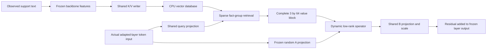

# VeRA-Mem

**Writable vector memory for a frozen language model, with sparse retrieval and dynamic low-rank injection.**

VeRA-Mem learns a shared read/write interface offline. At deployment, an observed fact is encoded into key/value records, and subsequent tokens query those records from the actual input of an adapted layer. Writing a new record does not optimize the backbone or the shared interface. The current backbone is **Qwen3-4B-Instruct-2507**, pinned to revision `cdbee75f17c01a7cc42f958dc650907174af0554`.

This is a research prototype for **continual memory through online state updates**. Controlled same-template fact writing works; reliable open-domain continual learning remains an objective. The latest whole-block reader improves some unseen content combinations, while unseen-entity and question-format generalization remain weak.

## Start here

| Read | Purpose |
| --- | --- |
| [Research path](docs/research_path.md) | The hypotheses, experiments, failures, and decisions that led to the current method |
| [Architecture](docs/architecture.md) | What Q/K/V mean, how a complete V block affects VeRA, and which parameters change offline versus online |
| [Latest experimental results](docs/block_results.md) | Full six-arm, three-seed comparison, controls, diagnostics, and limitations |
| [Reproducibility](docs/reproducibility.md) | Installation, current smoke commands, historical audits, artifact locations, and translation provenance |
| [Code map](docs/code_map.md) | Entry points, module families, and where to implement a new hypothesis |
| [Collaborator guide](CONTRIBUTING.md) | A bounded next-experiment plan and evidence requirements |
| [Documentation index](docs/README.md) | Every stage's protocol, literature, results, and machine-readable evidence |

## Current evidence

The latest experiment compares `diagonal`, `pooled_outer`, and `block_outer` under static and randomly reassigned entity/content bindings: **6 arms x 3 seeds = 18 models**. All final checkpoints were evaluated; no post-result model or seed selection was used.

The table shows **full-answer correctness after writing an unseen combination D for a known entity**, under random binding. Each seed evaluates 16 facts.

| Reader | Seed 91042 | Seed 91043 | Seed 91044 |
| --- | ---: | ---: | ---: |
| Diagonal VeRA | 3/16 | 3/16 | 2/16 |
| Pool V, then generate one outer product | 1/16 | 0/16 | 0/16 |
| **Generate outer products from the complete V block** | **6/16** | **7/16** | **3/16** |

The two outer-product readers have identical parameter counts and K/V storage. The block reader's stricter **update-and-restore** result is **6/16, 6/16, 3/16**. On new entities, canonical-format D accuracy falls to **3/16, 1/16, 1/16**; heldout question formats score **0/16** in every seed. The context-provided teacher scores **448/448** across its checks. The prespecified three-seed continuation gate was not met.

These results support a limited improvement in content readout. They do not establish that sparsity caused the earlier failures, that higher rank alone explains the gain, or that attention-like generalization has been achieved. Earlier single-output-vector readers also learned newly written facts under restricted formats; their benefit was not limited to an initialized bank. See the [claim boundaries](docs/research_path.md#what-we-can-claim).

## Read and write flow



The latest implementation retrieves **one fact group containing three rows**, not an arbitrary number of independent facts. Its additional operator is a sum of three outer products. All shared weights, including the offline-trained B projection, are frozen online. The [architecture document](docs/architecture.md) distinguishes this mechanism from pooled values, native Transformer KV caching, and full multihead attention.

## Install and check

Python 3.10+ is required. Install a PyTorch build compatible with the intended GPU environment before model experiments. CPU tests do not download the backbone.

```bash
git clone https://github.com/Concyclics/VeRA-Mem.git
cd VeRA-Mem
python3 -m venv ../env
. ../env/bin/activate
python -m pip install -e '.[test,data]'
python -m pytest -q
python scripts/check_repository.py
```

Keep model weights, datasets, checkpoints, and logs outside the code repository. The [reproduction guide](docs/reproducibility.md) provides explicit model preparation, smoke execution, and artifact-audit commands. Historical orchestration plans contain the original machine's paths and must not be run unchanged on a different machine.

## Repository scope and evidence

- `src/vera_mem/`: memory interfaces, stores, model hooks, datasets, training, and evaluation.
- `scripts/`: preparation, orchestration, audited summaries, diagnostics, and backup tools.
- `configs/`: initial pilot and baseline configurations; these are **not** the latest block experiment's complete settings.
- `tests/`: CPU contracts for storage, gradients, data boundaries, evaluation, and evidence validation.
- `docs/`: English research documentation, public results, and provenance.

The latest block study completed **96 formal jobs**, **22,048 formal generations**, **8,064 online writes/restores**, and replay checks for **106,565 stored student queries**. CPU audits validate saved evidence; they do not independently rerun Qwen generation. Raw run directories and immutable execution snapshots are maintained separately from this public repository.

The English handoff preserves experimental measurements and historical hashes. Exact historical protocols remain available at the pinned pre-localization revision; current translated documents are not retroactive preregistrations. See [translation and evidence provenance](docs/reproducibility.md#english-localization-and-sealed-evidence).
