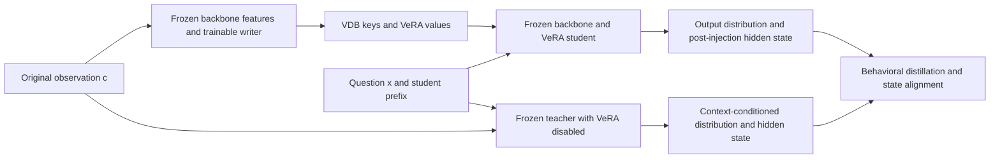

# Context-aware distillation: design and preliminary results

Using a context-conditioned original model to supervise a VDB–VeRA model without the original text has direct precedent in the literature. This round implemented and ran five controlled variants covering output distillation, hidden alignment, and on-policy trajectories. **Generalization to new expressions remains unresolved for the current single-layer VeRA. On-policy training shows a very small development-set signal, insufficient to establish an advantage over ordinary answer training.** Next steps should test sensitivity to specific fact changes, writer representations, and readout capacity; hidden similarity must not be treated as success.

This conclusion comes from a short-budget mechanism experiment with a fixed Qwen3-4B-Instruct-2507: 4096 training entities, 64 development entities, one training seed, and answers drawn from 16 words spanning only 1–2 tokens. It does not refute all context-distillation methods, or confirm long-horizon reasoning or realistic continual learning.

## How the literature supports the design

Four particularly direct precedents cover the training objective, state supervision, forward-pass writing, and memory retrieval:

| Original work | Most direct relevance |
| --- | --- |
| [OPCD 2026](https://arxiv.org/abs/2602.12275) | The student generates prefixes; a teacher with additional context supplies next-token distributions on the same prefixes, using reverse KL. |
| [SADA ACL 2026](https://aclanthology.org/2026.acl-long.1046/) | A full-context teacher guides dynamic adapters through hidden-state and output-distribution supervision, closely matching the proposed idea. |
| [Doc-to-LoRA 2026](https://arxiv.org/abs/2602.15902) | A general hypernetwork turns new context into LoRA in one forward pass, avoiding repeated input of the original text. |
| [Context Distillation as Latent Memory Management 2026](https://arxiv.org/abs/2605.28889) | Documents are individually distilled into a LoRA memory bank; queries retrieve, select, and gate adapters. |

Context teachers, hidden distillation, and retrievable parameter memory are therefore not new contributions by themselves. The open research question is: **Can a general writer produce small VeRA vectors under a shared fixed low-rank basis, and can internal layer inputs sparsely retrieve multiple values at each token to use new facts with lower write and storage costs?** Precise training differences, including GKD and Cartridges, are documented in [closely related work](context_distillation_related_work.md). These experiments neither reproduce nor outperform those complete systems.

## Implemented training path



During training, the teacher receives the corresponding observation text, whereas the student prompt contains only the question. Both receive identical continuation token IDs, aligned at their respective answer-prediction positions. On-policy continuations come from the current student; off-policy training uses correct-answer prefixes. The teacher disables VeRA and receives no gradients; backbone hashes are checked before and after training.

The initial state target is the hidden state **after the final RMSNorm and before lm_head**, downstream of the layer-20 VeRA injection. Gradients can therefore reach VeRA, whereas this single-layer increment cannot change pre-injection features. The objective is:

```text
L = L_output
  + 0.2 × all-style fact-address CE
  + 0.2 × actual-prediction-position address CE
  + every 4 steps: 0.25 × canonical-answer replay CE
  + hidden arms: 0.1 × [1 − cosine(h_student, stopgrad(h_teacher))]
```

The five arms are answer CE, off-KD, off-KD+hidden, on-KD, and on-KD+hidden. All four KD arms use full-vocabulary reverse KL at temperature 1, holding KL direction fixed in the on/off comparison. Each starts from the same anchored writer/reader and receives 256 batch-8 updates, with no development-based checkpoint selection. Online reading still uses a CPU VDB; training recomputation uses an equivalent differentiable GPU episode bank. New development facts are written through forward-generated vectors only, with shared weights frozen.

The on/off comparison measures **the effect of a recipe using student prefixes**. Generation length, EOS distribution, first-token weight after sequence averaging, and states seen by address CE also change with the prefix. It cannot isolate a single exposure-bias mechanism. Sampling is not differentiated; this is GKD-style training, not a full policy-gradient estimator.

## Results of the five variants

All cells below count correct answers under real VDB retrieval, out of 64 questions per column. The same entities recur across the four conditions. “New expressions” are development expressions unused in training but previously inspected for research diagnostics; they are not a blind test in this round. The two new observation styles and two new question styles are independently crossed, with 16 entities per pairing.

| Method | Original observation, original question | Original observation, new question | New observation, original question | New observation, new question |
| --- | ---: | ---: | ---: | ---: |
| Teacher with original text | 64 | 64 | 64 | 64 |
| Common initialization, no continuation | 58 | 0 | 1 | 0 |
| Answer CE | 59 | 3 | 0 | 0 |
| off-KD | 39 | 2 | 0 | 0 |
| off-KD + hidden | 31 | 3 | 0 | 0 |
| on-KD | 41 | 4 | 0 | 0 |
| on-KD + hidden | 40 | 3 | 0 | 0 |

The teacher with original text is correct throughout, demonstrating usable context supervision for this task. Changing the objective nevertheless failed to transfer that capability to new observation expressions: both new-observation conditions are 0/64 for all five trained arms. Ordinary CE retains 59/64 in the original format, while KD arms fall to 31–41/64, showing substantial degradation of existing performance.

For new questions with original observations, on-KD reaches 4/64, with both shuffled values and empty memory at 0/64. Answer CE reaches 3/64, again with both controls at 0/64. Bank content can therefore affect outputs, but a one-example advantage over CE does not establish a robust OPD benefit. All methods and interventions appear in the [record-level audit summary](results/context_distillation/report.md), rather than only the best cell.

Per-example checks further narrow the interpretation. The 4 on-KD successes include all 3 CE successes, and their answers are only apple or silver. Only 2/4 retrieve the correct entity in the initial top-4, and all 4/4 have 0 correct-record residency during subsequent decoding. The extra success initially retrieves another silver record rather than the correct entity. Each new question style has 32 examples: one style yields apple on 31 examples, while the other yields silver on 18. **The small accuracy gain may still reflect expression-style and output-word biases; bank sensitivity alone does not demonstrate reliable factual addressing.**

In this condition, on-KD improves over CE by +1.56 percentage points, with an entity-paired bootstrap 95% interval of [0.00, 4.69]. Its improvement over off-KD is +3.12 points, with an interval of [0.00, 7.81]. These are exploratory comparisons within a single trained instance and do not capture training randomness or uncertainty over expression families. Full paired differences, word frequencies, and trajectory statistics are in the [additional diagnostics](results/context_distillation/diagnostics.json).

## Addressing and state diagnostics

For new questions with original observations, prefill R@1 is only 3–4/64 across the five trained arms. The R@1 addressing bottleneck remains. Even forced correct values produce only 3–6/64 correct generations. This motivates studying writing and readout together, but forcing a single value changes the normal top-k mixture distribution. It is diagnostic, not a strict performance upper bound or proof that addressing has been fully isolated.

State alignment is not equivalent to behavioral improvement. For example, original-format off-KD increases final-hidden cosine from 0.673 at initialization to 0.721 while reducing generation accuracy from 58/64 to 39/64. First-token cosine likewise rises from 0.708 to 0.749 without preserving correct answers. The hidden auxiliary does not consistently improve this round's metrics: for new questions with original observations, on-KD first-token cosine is 0.653 and falls to 0.637 with the hidden term.

These quantities are measured on common correct-answer prefixes and reported separately from free-generation EM. All-token averages include answer subtokens and EOS; correct prefixes must not conceal first-token failures. The no-memory model itself has teacher cosine around 0.56–0.60, so reporting absolute similarity alone would exaggerate the effect.

Answers are short, and on/off prefixes are identical at the first prediction position. OPD-specific state differences primarily concern later subtokens and termination. On clean correct-answer prefixes, the teacher's answer-token NLL is approximately 10⁻⁶, indicating high confidence in the correct token. This may limit the extra information provided by the soft distribution there, and motivates separate investigation of KL direction and temperature. It does not establish that the teacher remains correct or equally confident on erroneous student prefixes. These are hypotheses for follow-up, not identified causes of failure.

Training-trajectory checks show that only 109 of 2048 on-KD samples match the gold first token (5.32%), and 95 complete sequences match gold. Mean generation length is 3.11 tokens; 59.81% encounter actual EOS, and 823 sequences truncate at the 4-token limit. Among 4323 prediction positions after the first, only 116 retain a history matching the correct answer. Pure on-policy training therefore sees many incorrect histories in this multi-format experiment and cannot retract an incorrect first token already emitted. Warm-up followed by mixed student trajectories is worth testing rather than assuming all incorrect histories are equally useful supervision; that improvement has not been tested here.

## Cost and reproducibility scope

Each arm has 2048 main fact exposures and 512 additional canonical replay exposures. The main targets cover 2048 distinct facts from the 4096-fact training pool; other facts can appear as episode candidates. This is not complete training coverage of the entire pool. Equal exposures and updates do not imply matched computation:

| Method | Training seconds | Main target tokens | Total training-forward input positions |
| --- | ---: | ---: | ---: |
| CE | 26.4 | 4858 | 148745 |
| off-KD | 38.6 | 4858 | 334809 |
| off-KD + hidden | 32.4 | 4858 | 334809 |
| on-KD | 69.6 | 6371 | 701039 |
| on-KD + hidden | 69.0 | 6473 | 706798 |

Times cover the runner's training loop, not full evaluation. Shared-server conditions and execution order affect duration; the two off-KD timings do not establish that hidden supervision accelerates training. Input-position counts exclude padding but include teacher, student, sampling, and replay forwards; they are not FLOPs. On-policy sampling reruns forwards without a KV cache here, so its cost does not represent an optimized serving implementation.

The numeric keys/values of 64 development memories occupy 32768 bytes, or 512 bytes per entry. This excludes metadata, indexes, shared writers, fixed A/B, the backbone, and runtime overhead. It establishes only a small entry representation, not end-to-end storage or latency advantages.

The fixed protocol and run source come from commit `daf97c5`, with model revision `cdbee75f17c01a7cc42f958dc650907174af0554`. All six formal runs are complete/exit0, with 6144 student predictions, 256 teacher predictions, and 1536 alignment diagnostics. Source snapshots, logs, final checkpoints, and VDBs from both suites are retained with private raw results. Implementation checks include a real-Qwen gradient smoke: Q/K/V/b are trainable, hidden-only supervision produces nonzero Wv/b gradients, and the teacher is frozen. The detached offline inference interface was not mistaken for a training path.

All 205 final local tests passed. During aggregation, an auditor schema error treated the VDB's per-component byte dictionary as a single integer. This was fixed with tests for the real dictionary format and malformed data. The fix did not alter training, predictions, or frozen run snapshots.

Run and aggregation entry points are `scripts/run_context_distillation_suite.py` and `scripts/summarize_context_distillation.py`. Fixed parameters, input-access constraints, and stopping rules are in the [exploratory protocol](context_distillation_protocol.md). Public `summary.json` records source/input hashes, per-example metric recomputation, and paired bootstrap results. Bootstrap resamples entities, moving all four conditions together; repeated expressions are not independent samples. Intervals do not capture training-seed or entirely new expression-family uncertainty.

## Strengthening the next round's training signal

The following are proposed follow-ups, not additional tuning conducted on this same development set.

1. **First distinguish factual changes from expression changes.** Construct two counterfactual contexts with identical entity and relation but different values, alongside semantically equivalent paraphrases. A context-conditioned teacher must change its answer with the value while preserving facts across equivalent expressions. Supervise the student after writing each bank separately. Align the hidden-state difference induced by the two contexts rather than merely increasing whole-hidden cosine. Behavioral KL/CE and answer changes after memory replacement remain the main acceptance criteria. Check teacher fact sensitivity before using an episode for training.
2. **Test KL choice and OPD in separate stages.** Warm up with forward KL or answer CE plus a fact-discrimination auxiliary, then compare fixed, student, and mixed trajectories from a common checkpoint that can already read training facts. Ablate KL direction, temperature, and hidden coefficient separately rather than changing them together and crediting OPD. Retain canonical replay and record first-token and parameter-group gradient magnitudes; loss values alone cannot show whether a 0.1 hidden weight is sufficient.
3. **Compare writer interfaces and capacity separately.** Motivated by SADA, test attention outputs and compare the current single support feature with multi-token pooling. Compare linear/nonlinear Q/K and single-/multilayer VeRA with the output objective held fixed. Do not attribute interface or capacity gains to distillation. Pre-injection features can be studied as writer inputs, but should not be targets that the same-layer VeRA is expected to directly change.
4. **Use more discriminating data and validation.** Add genuine multi-token field values, multi-relation facts, and questions requiring two memories. Do not create an OPD advantage through verbosity. Seal independent confirmation entities and structural families, use at least three training seeds, and report both fact-budget and compute comparisons. Evaluate new writes, updates, deletion, distractors, and irrelevant questions with real, shuffled, empty, and oracle conditions.

The most useful next-round criteria are consistent gains over budget-matched CE on independent expressions, a clear advantage of the correct VDB over shuffled and empty banks, and appropriate answer changes after replacing one fact, while controlling canonical-format degradation. Only after those criteria are met should storage, write, and read costs be compared against D2L/SADA-style document adapters and external retrieval routing.
