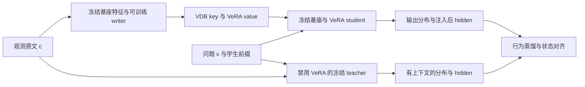

# Context aware 蒸馏方案与初步实验结果

有上下文的原模型监督无原文的 VDB–VeRA 模型，有直接的文献依据。本轮已经实现并运行了输出蒸馏、hidden 对齐和 on-policy 轨迹的五组对照。**当前单层 VeRA 在新表达上的泛化仍未解决；on-policy 有很小的开发集信号，但不足以证明比普通答案训练更有效。** 下一步应检验对具体事实变化的敏感性，以及写入表示和读出容量，而不能把 hidden 相似度当作成功标准。

本结论来自固定 Qwen3-4B-Instruct-2507 的短预算机制实验：4096 个训练实体，64 个开发实体，单训练 seed，答案来自16个词且仅1–2个 token。它不是对所有 context distillation 方法的否定，也不是长程推理或真实持续学习的确认结果。

## 文献如何支持这个方案

最直接的四个先例分别覆盖了训练目标、状态监督、前向写入和记忆检索：

| 原始工作 | 对本项目最直接的依据 |
| --- | --- |
| [OPCD 2026](https://arxiv.org/abs/2602.12275) | 学生自己生成前缀，有额外 context 的教师在相同前缀上提供下一 token 分布，使用 reverse KL。 |
| [SADA ACL 2026](https://aclanthology.org/2026.acl-long.1046/) | 完整上下文教师指导动态 adapter，包含 hidden 状态和输出分布监督；与用户提出的想法非常接近。 |
| [Doc-to-LoRA 2026](https://arxiv.org/abs/2602.15902) | 通用 hypernetwork 一次前向将新 context 转成 LoRA，之后不必重复输入原文。 |
| [Context Distillation as Latent Memory Management 2026](https://arxiv.org/abs/2605.28889) | 文档分别蒸馏成 LoRA 记忆库，查询时检索、选择并门控 adapter。 |

因此，本项目不能将 context teacher、hidden 蒸馏或可检索参数记忆本身作为新贡献。待验证的研究问题是：**共享固定低秩基下的小型 VeRA 向量，能否经通用 writer 写入，并由内部层输入逐 token 稀疏召回多个 value，以较低写入和存储成本使用新事实？** 相关工作的精确训练差别见[最近相关工作](context_distillation_related_work.md)，包括 GKD 和 Cartridges；当前实验没有复现或击败这些完整系统。

## 已实现的训练链路



训练时 teacher 接收对应观测原文，student 的 prompt 只有问题。两者输入完全相同的 continuation token IDs，各自在自己的答案预测位置对齐。on-policy 的 continuation 来自当前 student；off-policy 使用正确答案前缀。teacher 不启用 VeRA、不接受梯度，基座参数在训练前后校验哈希。

第一轮的状态目标取**最后 RMSNorm 后、lm_head 前**的 hidden，位于第20层 VeRA 注入之后。它可以接受 VeRA 的梯度，而注入前的输入特征无法被该单层增量修正。损失为：

```text
L = L_output
  + 0.2 × 全风格事实寻址 CE
  + 0.2 × 实际预测位置寻址 CE
  + 每4步一次 0.25 × 原格式答案回放 CE
  + hidden组 0.1 × [1 − cosine(h_student, stopgrad(h_teacher))]
```

五组分别是答案 CE、off-KD、off-KD+hidden、on-KD、on-KD+hidden。四个 KD 组统一使用完整词表 reverse KL、温度1；这样不把 KL 方向改变混入 on/off 对照。每组从同一 anchored writer/reader 初始化，固定256次 batch-8 更新，不按开发集挑选 checkpoint。线上读取仍是 CPU VDB，训练重算使用保留梯度的等价 GPU episode bank；新开发事实只前向写向量，共享权重保持冻结。

on/off 的比较衡量的是**使用学生前缀这一训练配方的效果**：生成长度、EOS 分布、每序列平均后的首 token 权重，以及地址 CE 所见状态也随之前缀改变。它不能进一步把收益归因为某一个纯 exposure-bias 机制。采样过程不反传梯度；这采用 GKD 式训练，不是完整策略梯度估计。

## 五组尝试的实际结果

下面均为真实 VDB 检索时答对的题数，每列64题；同一批实体在四种条件重复评估。“新表达”是训练未使用的开发表达，但此前已用于研究诊断，不能称为本轮盲测。新观测和新问句的两种风格独立交叉，四种配对各16个实体。

| 方法 | 原观测 原问句 | 原观测 新问句 | 新观测 原问句 | 新观测 新问句 |
| --- | ---: | ---: | ---: | ---: |
| 有原文的 teacher | 64 | 64 | 64 | 64 |
| 共同初始化 未继续训练 | 58 | 0 | 1 | 0 |
| 答案 CE | 59 | 3 | 0 | 0 |
| off-KD | 39 | 2 | 0 | 0 |
| off-KD 加 hidden | 31 | 3 | 0 | 0 |
| on-KD | 41 | 4 | 0 | 0 |
| on-KD 加 hidden | 40 | 3 | 0 | 0 |

有原文 teacher 全部正确，说明该任务存在有效的上下文监督。可是改变训练目标并未将这种能力转移到新观测表达上：五个训练组两个新观测条件全部0/64。原格式的普通 CE 保持59/64，四个 KD 组降至31–41/64，存在明显的原有能力退化。

新问句配原观测时，on-KD 为4/64，打乱 value 和空记忆均0/64；答案 CE 为3/64，打乱和空记忆也均0/64。这表明 bank 内容能够影响输出，但 on-KD 比 CE 仅多一题，不能据此宣称稳健的 OPD 优势。全体方法与全部干预都保留在[逐记录审计汇总](results/context_distillation/report.md)，不只报告最好的单元格。

逐题检查进一步收窄了这个小信号的含义：on-KD 的4题成功包含 CE 的全部3题，答案都属于 apple 或 silver。仅2/4在首步 top-4 中包含正确实体，4/4的后续 decode 正确记录驻留率为0；新增的一题首步没有召回正确实体，却召回了另一个 silver 记录。两种新问句各32题，其中一种31题都输出 apple，另一种18题输出 silver。**正确率小幅提高仍可能来自表达风格与输出词偏置；bank 敏感性不能单独证明可靠的事实寻址。**

该条件下 on-KD 相对 CE 的差值为+1.56个百分点，实体配对 bootstrap 95%区间为[0.00, 4.69]；相对 off-KD 为+3.12个百分点，区间[0.00, 7.81]。这是同一训练实例内的探索性比较，不包含训练随机性或表达族不确定性。完整成对差值、词频和轨迹统计见[附加诊断](results/context_distillation/diagnostics.json)。

## 寻址和状态诊断

新问句配原观测时，五个训练组的 prefill R@1 只有3–4/64，R@1 的瓶颈没有消失。强制给正确 value 的生成也只有3–6/64。后者提示需要同时研究写入和读出，但强制单个 value 改变了正常 top-k 混合分布，它只是诊断，不能视为严格的性能上界或完全隔离寻址的证明。

状态对齐与行为效果并不等价。例如原格式的 off-KD 最终 hidden cosine 从初始化的0.673升到0.721，生成却从58/64降到39/64；相应首 token cosine 从0.708升到0.749，仍没有保住正确答案。添加 hidden 项也没有稳定改善本轮指标：新问句配原观测，on-KD 的首 token cosine 为0.653，加 hidden 后为0.637。

这些值是在统一正确答案前缀上计算的，与自由生成 EM 分开报告；全 token 平均包含答案子词及 EOS，不能让已经给出的正确前缀掩盖首 token 失败。无记忆模型自身对 teacher 的 cosine 也达到约0.56–0.60，所以只报告绝对相似度会夸大效果。

当前答案短，首个预测位置的 on/off 前缀相同，OPD 特有的状态差异主要发生在后续子词和结束符。teacher 在干净的正确答案前缀上，答案 token NLL 约为10⁻⁶，对正确 token 高度自信；这可能限制该处软分布提供的额外信息，也值得单独研究 KL 方向和温度。它不证明 teacher 在学生错误前缀上仍然正确或同样自信。这里是后续假设，不能从当前五组结果确认为失败原因。

训练轨迹核验显示，on-KD 的2048条采样中，首 token 与 gold 一致的只有109条（5.32%），95条完整序列与 gold 相同。平均生成3.11个 token，59.81%遇到真实 EOS，823条在4 token 上限截断。首位置后的4323个预测位置中，仅116个仍与正确答案历史一致。因此，纯 on-policy 在本次多格式训练中大量接收错误历史，且无法在生成后撤回已经输出的错误首 token。作为后续方案，先预热再混合学生轨迹，比把全部错误历史直接视作同等有益的监督更值得检验；当前结果尚未验证该改进。

## 成本与复现范围

五组均有2048次主要事实曝光，额外512次原格式回放。此次主要目标覆盖4096训练池中的2048个不同事实，其余事实可作为 episode 的候选记录出现；不能称为整个训练池已完整训练。相同曝光和更新次数不代表计算匹配：

| 方法 | 训练秒数 | 主要目标 token | 训练前向输入位置总数 |
| --- | ---: | ---: | ---: |
| CE | 26.4 | 4858 | 148745 |
| off-KD | 38.6 | 4858 | 334809 |
| off-KD 加 hidden | 32.4 | 4858 | 334809 |
| on-KD | 69.6 | 6371 | 701039 |
| on-KD 加 hidden | 69.0 | 6473 | 706798 |

时间包含该 runner 的训练循环，不含完整评估；共享服务器和执行顺序会影响耗时，不能从 off-KD 两个数字宣称 hidden 加速。输入位置计数不含 padding，但包含 teacher、student、采样和回放，不能等同 FLOPs。on-policy 本轮采用无 KV cache 的重新前向采样，成本不能直接代表优化后的服务实现。

64条开发记忆的 key/value 数值共32768字节，即每条512字节；这不含元数据、索引、共享 writer、固定 A/B、基座和运行时开销。这里只证实了小规模条目表示，尚未建立端到端存储或时延优势。

固定协议及运行源码来自提交 `daf97c5`，模型 revision 为 `cdbee75f17c01a7cc42f958dc650907174af0554`。六个正式运行全部 complete/exit0；共有6144条 student 预测、256条 teacher 预测、1536条对齐诊断。两个 suite 的源码快照、日志、最后 checkpoint 和 VDB 随私有原始结果保存。实现检查包含真实 Qwen 梯度 smoke：Q/K/V/b 可训练、hidden 单独对 Wv/b 梯度非零、teacher 冻结，且没有将离线 detach 推理接口误作训练路径。

最终本地205项测试通过。汇总时修正了审计器把 VDB 的分项字节数字典当成单个整数的 schema 错误，并新增真实字典格式和畸形数据检查；此修正未改变训练、预测或已冻结的运行快照。

运行与汇总入口分别是 `scripts/run_context_distillation_suite.py` 和 `scripts/summarize_context_distillation.py`。已固定的完整参数、输入权限、停止规则见[尝试协议](context_distillation_protocol.md)；源文件和输入哈希、逐题指标重算及成对 bootstrap 在公开 `summary.json` 中记录。Bootstrap 按实体抽样，四个条件一起随实体移动，不将重复表达当成独立样本；其区间不覆盖训练 seed 或全新表达族的不确定性。

## 下一轮如何加强训练信号

以下是待实施的后续设计，本轮没有用它们继续在同一开发集上调参。

1. **先学习区分事实改变与表达改变。** 每个训练 episode 构造两条实体和关系相同、值不同的反事实 context，另构造若干语义等价改写。有 context teacher 必须随值改变答案，同时对等价改写保持事实一致。学生在分别写入两个 bank 后接受相同监督。对齐两条 context 引起的 hidden 差异，而不是仅提高单个 hidden 的整体 cosine；行为 KL/CE 和记忆替换后的答案变化仍是主要验收依据。teacher 先检查事实敏感性，再将该 episode 用于训练。
2. **把 KL 选择和 OPD 分成两个阶段检验。** 先以 forward KL 或答案 CE 加事实区分辅助项预热，再在已能读取训练事实的共同 checkpoint 上比较固定数据、学生轨迹及混合轨迹。KL 方向、温度和 hidden 系数分别消融，不能同时改动后归功于 OPD。保留原格式回放，并记录首 token 梯度与分组梯度规模；不能只凭损失数值大小判断0.1 hidden 权重是否足够。
3. **单独比较写入接口与容量。** 借鉴 SADA 检验 attention 输出，比较当前单个 support 特征与多 token pooling；比较线性 Q/K、非线性 Q/K，以及单层和多层 VeRA。先固定输出训练目标再做此对照，避免把接口或容量收益算成蒸馏收益。预注入特征可以作为 writer 输入研究，但不应成为要求同层 VeRA 直接修正的 hidden 目标。
4. **使用更有辨识度的数据和验证。** 添加多 token 的真实字段值、多关系事实和需要两条记忆组合的问题；不要靠冗长解释人为制造 OPD 优势。新确认实体与结构表达族独立保留，至少三个训练 seed，同时报告同事实预算与计算成本。评估覆盖新写入、更新替换、删除、干扰记忆和无关问题，并比较 real、shuffled、empty 与 oracle。

下一轮最有用的验收条件是：在独立表达上稳定超过同预算 CE，正确 VDB 明显优于置换和空库，并且替换一条事实能相应改变答案，同时控制原格式退化。达到这些条件后，再与 D2L/SADA 风格的文档 adapter 和外部检索路由做存储、写入和读取成本对照。
