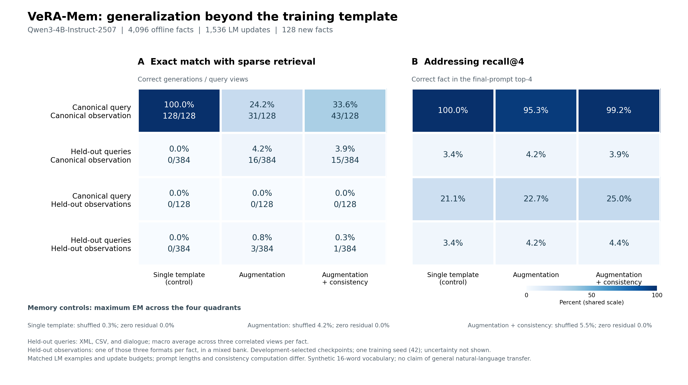

# VeRA-Mem expression generalization: results and student handoff

This round completed data augmentation, Q/K/value consistency training, and a diagnostic that projects out training-template directions. **Format generalization remains unresolved on the held-out XML/CSV/dialogue formats under this single-layer configuration and fixed training budget.** The few new-question successes from ordinary augmentation match shuffled-value controls, providing no evidence of entity-correct memory reading; augmentation also damages original-template performance. These results do not support replacing the existing same-template model with the augmented checkpoints.

Complete values are in the [individually audited results](results/generalization/report.md) and [machine-readable summary](results/generalization/summary.json). The [experimental protocol](generalization_protocol.md) was fixed before confirmation results were produced. Historical scaling results remain in the [previous report](scaling_results.md). Its training and selection rules differ, so improvements in this round should be measured against this round's single-template control.



## 1. Completed comparisons

The backbone remains frozen Qwen3-4B-Instruct-2507, with zero-indexed layer-20 down_proj, rank/key=64, and top-k=4. Each actual token's layer input generates a query; sparsely retrieved VDB values modulate the VeRA branch. New observations generate writable keys/values. No text RAG, entity-string parser, independent answer-parameter table, or online shared-weight training is introduced.

All three arms use the same 4,096 offline entities, 400 addressing warm-up updates, and 1,536 batch-8 LM updates, yielding 12,288 target-fact exposures. The first 768 LM updates use a correct-value curriculum; the last 768 use real sparse retrieval. Entity InfoNCE remains throughout, with address loss at actual answer-prediction tokens in the second half. Independent RNGs match target/negative entities across all arms and primary views across the two augmented arms.

- Single template: one original question form and one original observation form.
- Multiple templates: independently sample 8 question forms and 4 observation forms. These include the previously tested paraphrase, which is no longer an unseen expression.
- Augmentation + consistency: use the same primary views plus a second view of each fact. Apply cosine consistency to queries/keys and MSE to values, all with coefficient 0.1. Negative examples and LM loss remain active.

Centers use training views only. Checkpoints are selected by mean real-retrieval NLL over five expression combinations on new development entities; confirmation data do not select the step. Selected steps and costs follow. Training times include periodic development validation but exclude feature preparation and full generation evaluation.

| Training arm | Selected step | Training prompt tokens | Training-stage seconds |
| --- | ---: | ---: | ---: |
| Single-template control | 1536 | 676,617 | 150.8 |
| Multi-template augmentation | 1536 | 687,838 | 146.4 |
| Augmentation + consistency | 1536 | 687,838 | 159.4 |

Matched updates and examples do not imply identical FLOPs: template lengths differ, and consistency adds encoder computation. There is one training seed=42; this is not a multi-seed result.

## 2. Confirmation results

The confirmation set has 128 new entities and three question-expression families—XML, CSV, and dialogue—absent from training and model selection. Facts are revealed and written into an initially empty VDB, followed by final retention checks. Observation banks use either the original expression or a mixture cycling through three unseen expressions by fact. The mixed bank does not independently cover every entity in every observation form.

The table reports exact match under real sparse retrieval. New-question columns average three templates equally, with 384 answers over 128 independent facts. Original-question columns contain 128 answers.

| Training arm | Original question / original observation | New question / original observation | Original question / new observation | New question / new observation |
| --- | ---: | ---: | ---: | ---: |
| Single-template control | 100.00% | 0.00% | 0.00% | 0.00% |
| Multi-template augmentation | 24.22% | 4.17% | 0.00% | 0.78% |
| Augmentation + consistency | 33.59% | 3.91% | 0.00% | 0.26% |

Evaluation also includes forced correct values, shuffled value associations, and zero residual. Forced values inject a fixed value at every token and change the real retrieval distribution, so they are not a mathematical upper bound. All three arms verify unchanged online shared parameters, 128 observations per bank, and zero online optimization steps.

## 3. Why the small gains are not success

The vocabulary contains 16 words. On a balanced confirmation set, always emitting any one candidate word gives 6.25% accuracy. For CSV questions against the original-observation bank, the multi-template arm emits `forest` for all 128 entities. For dialogue questions it emits `lemon` 124 times and `forest` 4 times. This is not entity-specific retrieval of the correct memory.

Key interventions for new questions + original observations:

| Training arm | Real | Shuffled | Empty | Real − shuffled (percentage points, 95% CI) |
| --- | ---: | ---: | ---: | --- |
| Single-template control | 0.00% | 0.00% | 0.00% | 0.00 [0.00, 0.00] |
| Multi-template augmentation | 4.17% | 4.17% | 0.00% | 0.00 [0.00, 0.00] |
| Augmentation + consistency | 3.91% | 3.91% | 0.00% | 0.00 [-0.78, 0.78] |

Intervals use the 128 facts as clustered paired resampling units, retaining all question forms of a fact, with 10,000 bootstrap resamples. They include fact-sampling uncertainty only, not training randomness, and have no multiple-comparison correction. All between-arm and memory-intervention differences across the four conditions appear in the audit report.

## 4. Observed failure patterns

**Addressing is strongly format-sensitive.** Training-template mean differences account for approximately 94.06% of centered query energy and 79.94% of support energy; these are not proportions of semantic information. A training-estimated style-subspace projection improves development original-question/new-observation Recall@1 from 13/64 and 6/64 to 30/64 and 27/64, but unseen-query Recall@1 remains only 2/64 and 4/64. This is a 400-step addressing probe without actual generation, not a replacement for end-to-end results. See the [addressing diagnostic](generalization_address_diagnostic.md).

**The writer has not learned values compatible across observation expressions.** In ordinary augmentation's training values, the template main effect accounts for 84.75% of variance and the answer main effect for only 8.19%. Mean same-fact value cosine between training expressions support00 and support02 is −0.875; for 00 versus 01/03 it is +0.932/+0.940. Not all expression pairs reverse direction. Consistency lowers the template fraction only to 81.43% and raises 00/02 cosine to −0.814, leaving that reversal. A linear classifier's ability to decode the original template does not establish transfer to new formats, much less correct generation by the fixed VeRA reader. See the [three-arm writer diagnostic](generalization_value_diagnostic.md).

**The multi-template arms may still be undertrained.** Final-segment LM loss is approximately 0.045 for the single-template arm, 1.826 for augmentation, and 1.720 for consistency. This round tests a fixed budget; it does not establish that longer training, a different curriculum, or stronger consistency would also fail. The probes alone likewise cannot establish that backbone hidden states lack answer information.

## 5. Priorities for subsequent experiments

1. First test writer compatibility across expressions. Hold training facts fixed while changing entity/answer position, instruction order, and record structure; compare training and entirely new formats. Jointly measure same-fact value consistency, answer separability, and actual generation rather than optimizing vector cosine alone.
2. Separate training budget from representation changes. Retain canonical replay and introduce augmentation gradually; longer training requires a control with the same update budget. The current 0.1 consistency coefficient is only one setting. Any future coefficient sweep should use development data only.
3. If unseen-question addressing remains near random, separately test multi-position aggregation over observations or learned read/write encoders, reporting parameter and compute costs. Actual reading must still form queries from VeRA-layer inputs; external entity parsing or text RAG must not replace the main method.
4. Use new confirmation entities and expression families, with more training seeds. This round's XML/CSV/dialogue results have now been analyzed and cannot be reused indefinitely to select methods. Expand to natural-language facts and real datasets afterward.

These are hypotheses for the next round. Unrun changes are not reported as implemented performance improvements.

## 6. Code, evidence, and reproduction

Main implementation: [generalization_run.py](../src/vera_mem/generalization_run.py), [expressions and entity splits](../src/vera_mem/augmentation_data.py), and [frozen-source launcher](../scripts/run_generalization_suite.py). Aggregation verifies suite/run completion and exit codes, source/cache/model fingerprints, every prediction's EM, all 36 phase/method groups, both VDB write streams, and control facts. The three formal runs contain 13,248 predictions; smoke results are excluded from the conclusions.

Raw predictions, training logs, best/last checkpoints, VDBs, source snapshots, and data caches are backed up in the workspace. Open-source backbone weights and private student materials are not uploaded to the repository. The public repository contains code, protocols, and aggregate results only.

Feature preparation:

```bash
PYTHONPATH=src python -m vera_mem.generalization_run \
  --model /path/to/Qwen3-4B-Instruct-2507 \
  --cache /path/to/workspace/data/generalization/features_v1.pt --prepare-only
```

After checking that the target GPU is available, launch control, augment, and invariant separately, using new unique run names:

```bash
python scripts/run_generalization_suite.py \
  --workspace /path/to/workspace --gpu GPU-UUID \
  --name generalization_augment_NEW --profile augment \
  --cache /path/to/workspace/data/generalization/features_v1.pt
```

After completion, run `scripts/summarize_generalization.py` and `scripts/plot_generalization.py`. The launcher refuses to overwrite an existing suite and records GPU UUID, processes, environment, and actual commands. It does not take control of other processes.
