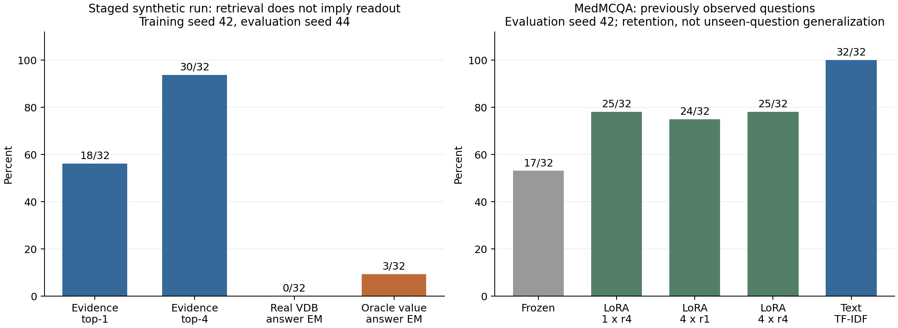

# 初步实验：机制已实现，记忆能力尚未成立

实验日期：2026-10-05。基座为 **Qwen3-4B-Instruct-2507**，固定模型 revision `cdbee75f17c01a7cc42f958dc650907174af0554`。实测使用 NVIDIA H100 PCIe。以下是小样本探索性实验，不是方法优越性或长期记忆能力的确认性结果。

**最重要的结果：逐 token 的 VDB–VeRA 读写路径已经跑通，但当前训练配方没有得到可用的新事实记忆。** 最后一轮中，32 个新事实有 30 个的正确记录进入了 top-4，真实检索生成仍为 0/32；强制读取正确 value 时为 3/32。文本检索对照为 32/32。因此下一步应先解决 value 到 VeRA 的读出与训练，再扩充数据库规模。



图中每组仅 32 个事实，两个面板属于不同数据与条件；不能将检索命中率与回答准确率等同。

## 实际运行的机制

在 Qwen 第 20 层（零起始编号）的 `mlp.down_proj` 插入适配分支，输入维度 9728，输出维度 2560。每次前向都使用当前 token 的真实层输入生成 query；在线 key/value 留在 CPU 精确向量库中，查询执行 cosine top-4，再将混合后的 64 维 value 传回 GPU：

```text
q_t = normalize(Wq · RMSnorm(x_t))
vbar_t = weighted_top4_values(q_t, VDB)
delta_t = b ⊙ B[(A x_t) ⊙ vbar_t]
y_t = frozen_down_proj(x_t) + delta_t
```

A/B 是固定随机矩阵。Wq/Wk/Wv/b 在离线阶段训练；在线阶段全部冻结。新观测的完整 support 经过关闭适配分支的基座，以同层最后一个 prompt token 的输入生成 key/value，随后提交 VDB。读取不更新数据库；每次生成期间快照固定。在线没有对新事实执行共享参数梯度更新。

这属于**输入生成的外部参数化向量记忆**：value 在 VeRA 分支中充当动态 rank 缩放参数。观测支持文本包含新事实答案，因此实验是监督观测后的写入，不能称为无监督 TTT。原型实现 CPU 精确平坦索引和原子持久化，不是生产级并发 VDB 服务。

## 数据、训练预算与对照

| 项目 | 本轮设置 |
| --- | --- |
| 离线合成训练 / 开发 | 128 / 32 个不同实体；16 个常见词作为均衡答案词表 |
| 在线每个条件 | 32 条 priming 观测 + 32 条新事实 + 16 条从未写入的控制事实 |
| 在线测量 | 先预测后写入；每条立即测量；每 8 条测旧事实；最后测 priming、控制和替换问法 |
| 适配维度 | rank=64，key_dim=64，top-k=4，temperature=0.2 |
| 离线训练 | 200 步 Q/K 对比对齐；3 个 epoch、384 次答案监督更新 |
| 优化器 | Adam；Q/K/V 学习率 0.001；b 学习率 0.03；梯度范数上限 1 |
| LoRA 对照 | 单槽 r4；四槽 r1；四槽 r4；每个 priming/online 事实 5 步，学习率 0.0005 |
| 生成和评分 | 官方 chat template；greedy；最多 8 个新 token；完整答案规范化 EM |
| MedMCQA | train 抽 64 题分成 priming/online；独立 validation 抽 16 题作控制；不使用解释字段 |

训练只对答案及 EOS 计算损失。报告 NLL/PPL 只计算答案 token，不包含 EOS；PPL 为 `exp(total_answer_nll / total_answer_tokens)`。MedMCQA 同时报四个候选字母的条件对数概率准确率，本轮最终分数与生成字母 EM 相同。

原始、中心化、分阶段三轮的共享训练种子都为 42，离线实体固定；在线评估种子依次为 42、43、44，后两轮使用新的事实与 priming。这是**逐步诊断的开发过程，不是三个训练种子的独立复现**。不同在线种子的成绩不能直接作为单因素效果差异来检验；对应轮内的对照使用相同事实。

## 三轮主架构结果

每个生成结果的分母为 32 个在线事实。检索指标取生成前最后一个 prompt token，未混入 teacher-forced 答案。

| 运行 | 在线 seed | 真实检索 top-1 / top-4 | 真实检索 EM | 正确 value 条件 EM | value 置换 EM | 零增量 EM |
| --- | ---: | --- | --- | --- | --- | --- |
| 初版联合训练 | 42 | 9/32 / 21/32 | 0/32 | 0/32 | 0/32 | 0/32 |
| 仅中心化 Wv 输入 | 43 | 0/32 / 2/32 | 1/32 | 0/32 | 0/32 | 0/32 |
| 中心化 + 冻结寻址 + 正确证据读出训练 | 44 | 18/32 / 30/32 | 0/32 | 3/32 | 0/32 | 0/32 |

各轮文本 TF-IDF 与文本 oracle 对照均为 32/32。最后一轮的 oracle 表示强制使用正确记录的单个 value，是诊断条件，**不是保证数值最高的数学上界**：单 value 与真实 top-4 混合的分布不同。

### 初版失败：所有 value 完全相同

初版最终 VDB 的 64 条 value 只有 **1 条唯一向量**，所有维度标准差为 0，4096 个元素全部达到 `|v|≥0.999`，每条向量范数均为 8。任意两条 value 的 cosine 为 1，而 keys 仍彼此不同。

这使真实检索、oracle 与置换条件在参数化 value 上退化为相同调制。答案 token NLL 从无记忆的 12.477 降到约 2.76，却没有新事实 EM 收益。该下降可以由共享分支学到答案词表/格式先验解释，不能证明事实已被存储。诊断证据见 [初版向量分布](results/diagnostics/initial_value_collapse.json)。

### 中心化避免了完全相同，但寻址又退化

只在 Wv 输入中减去**离线训练 support** 的 RMS-normalized 特征均值，均值固定保存在 checkpoint；Wq/Wk、学习率和其他结构不变。64 条 value 变为 64 条不同向量，饱和元素比例降到 28.9%。但 keys 的平均两两 cosine 达到 0.995，开发集 top-1 从 warm-up 后的 53.1% 降到联合训练后的 3.1%。

这是对当前联合优化配方的负面证据：避免 writer 的一种退化，并不保证寻址或读出有效。不能根据唯一向量数量就宣称获得了有用记忆。[中心化向量诊断](results/diagnostics/centered_vectors.json)

### 分阶段保住寻址，读出仍不足

第三轮在相同的对比对齐后冻结 Wq/Wk，清除它们的旧梯度；只训练 Wv/b，并在离线训练中提供正确 support 的单条 value。开发 checkpoint 按 **dev oracle answer-token NLL** 选择，没有用在线测试选择 checkpoint。

开发 top-1/top-4 保持在 53.1%/93.75%；新在线流的 top-1/top-4 为 56.25%/93.75%。64 条 value 彼此不同，饱和率约 22.5%。但真实检索 EM 仍为 0，oracle 仅 3/32，而且替换问法时 oracle 也为 0/32。因此当前证据只支持“寻址与 value 变化可以实现”，不支持“读出的事实记忆已经可靠”。[分阶段向量诊断](results/diagnostics/staged_vectors.json)

## LoRA 与医学任务对照

以下是在线 seed 42 的结果；全部是观测/写入后的同题重测。

| 方法 | 可训练适配参数 | 合成新事实最终 EM | MedMCQA 最终准确率 |
| --- | ---: | --- | --- |
| Frozen | 0 | 0/32 | 17/32（53.125%） |
| 文本 TF-IDF | 0，另计文本索引 | 32/32 | 32/32 |
| 文本 oracle | 0，另计原文 | 32/32 | 32/32 |
| LoRA 1×r4 | 49,152 | 1/32 | 25/32（78.125%） |
| LoRA 4×r1 | 49,152 | 3/32 | 24/32（75%） |
| LoRA 4×r4 | 196,608 | 5/32 | 25/32（78.125%） |

只有前两个 LoRA 条件总参数量相同。四槽 r4 的容量扩大四倍；本轮医学题没有超过单槽 r4。样本很小、学习率与训练步数未做等预算调优，不能从这张表得出多槽结构的总体优劣。

初版 synthetic writer 直接迁移到 MedMCQA 时，真实 VDB、oracle、零增量均为 17/32，未改善准确率。它从未在医学观测上学习写入接口，因此这只是**合成到医学的跨域诊断**，不能代表充分训练后的医疗记忆表现。

文本 RAG 的高分也有明确边界：支持文本已经包含合法揭示的答案，且重测使用相同问题/实体。它验证任务与读取链路可解，不是未知医学题泛化的 100% 准确率。

## 成本、实现纠正与证据边界

- 主架构离线共学习 1,870,336 个共享参数；固定随机 A/B 为 786,432 个 float32 元素，约 3 MiB。在线冻结这些参数，新增事实只写入向量。
- 每条 key/value 为 `(64+64)×4 = 512` 字节；64 条数值 payload 为 32 KiB，另计 ID、时间戳、容器与序列化开销。中心化统计 buffer 另为 38,912 字节。
- 这些短合成 support 的原文可能比 512 字节还小；本轮**没有证明比文本存储更省空间**。也没有证明大规模检索、CPU offload 延迟或总训练成本优势。
- GPU 峰值记录包含同进程离线训练；不能作为各读取方法的独立显存成本。重复条件可能复用冻结特征缓存，写入/基线读取计时不是部署基准。
- 初始 baseline evaluator 漏传了替换问法开关。原记录保留，在同一 checkpoint 上做了零训练步的 `paraphrase_correction` 补评；公开统计使用补评结果。该问题不影响原问题的最终 EM，也不影响主 VDB 方法的替换问法评估。
- value 置换打乱实体与向量的对应关系，但有限词表可能让某些置换保留相同答案类别；不能解释成每条语义答案都错。
- 零增量条件保留同样的记录生命周期，但禁用记忆残差；其输出等价于空读，不是零存储成本条件。
- 只有一个共享训练种子、固定支持模板和有限词表。未知实体控制的标签是隐藏随机词，其 EM 不是拒答率。LongMemEval、LoCoMo、冲突更新、百万条容量与多训练种子确认均尚未完成。

完整逐项汇总和事实配对 bootstrap：

- [初版与 MedMCQA](results/initial/report.md) / [机器可读统计](results/initial/summary.json)
- [中心化诊断](results/centered/report.md) / [机器可读统计](results/centered/summary.json)
- [分阶段诊断](results/staged/report.md) / [机器可读统计](results/staged/summary.json)

配对 bootstrap 仅描述本次事实样本的波动，不覆盖训练随机性。初版与后两轮的数据不同，报告不将跨轮成绩差解释为显著提升。

## 给学生的优先顺序

1. **先通过读出门槛。** 固定正确 value，先验证更小训练集能被拟合，再检验独立实体与替换模板；同时比较正确、置换、零 value。不要先扩大 VDB 或只追求 NLL 下降。
2. **稳定 writer。** 保留中心化诊断；研究 support 的内容 token/局部池化、value 辅助重建或语义监督，并持续记录方差、有效秩、饱和率。上述改动尚未获得本轮效果验证。
3. **再恢复真实逐 token 读取。** 保持已验证的 query/key checkpoint，比较 top-1/top-4、权重锐度、生成期间证据切换；问题级固定读取只作诊断消融，不能替代主架构。
4. **再验证连续学习。** 增加新事实、冲突 upsert、未知问题、分块保持和能力干扰；分离写入、寻址、读出和遗忘四个指标。
5. **最后进入真实会话与确认实验。** 先锁定训练配置，再用至少三个新的训练种子与未使用的在线事实做确认。MedMCQA 用于对齐已有研究；LongMemEval cleaned/LoCoMo 用于长会话外部验证。

文献与完整后续实验矩阵见 [literature_and_design.md](literature_and_design.md)，数据权限与划分见 [data_protocol.md](data_protocol.md)。
