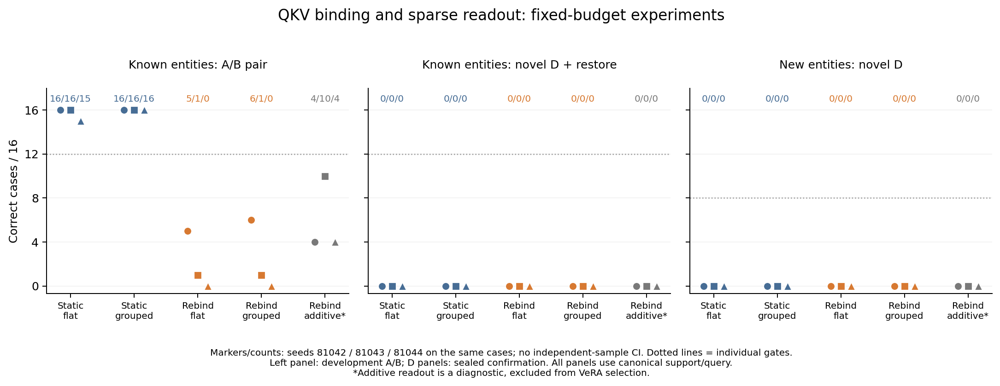

# Random Rebinding and Grouped QKV: Writable Vector Memory Experiments

**Status: all formal training, development, confirmation, and teacher results are complete and have been strictly recomputed locally.** All fifteen training, sixty student-evaluation, and five teacher jobs are present:75/75 model conditions, none pending or duplicated, and 448/448 fully correct teacher answers. Before any confirmation started, development selection was sealed as “no qualified candidate.” The frozen protocol, models, and selection rules did not change.

**Result: under this round's fixed budget, random rebinding and grouped QKV did not establish online reconstruction of complete novel combinations.** All fifteen models score 0/16 full EM on known/dev novel C, known novel D, and new-entity confirm D in all four phases. The additive diagnostic also fails, so the result cannot be attributed solely to VeRA's multiplicative path. Random rebinding helps A/B transfer of trained payloads to some new entities and improves some edited words, but seed variation is substantial and complete three-word combinations are not preserved. Development selection was sealed at `2026-10-06T13:50:07.472005+00:00` as `selected_arm=null`. Final confirmation did not change the conclusion; the fixed rules prohibit expansion to 256/1024 records. Local word improvements, lower NLL, or a single target-group hit do not substitute for complete writability.

Evidence: [fixed protocol](qkv_protocol.md), [literature mapping](qkv_literature.md), [complete summary](results/qkv/summary.json), [key metrics](results/qkv/key_facts.json), [sealed selection](results/qkv/selection.json), and [registration](results/qkv/registration.json). [Complete diagnostics](results/qkv/answer_diagnostics.json), [teaching examples](results/qkv/examples.json), [late-training metrics](results/qkv/training_convergence.json), and [historical plans](results/qkv/plans.json) are also retained.

> This is an English localization of the historical report. Protocol translations do not replace sealed sources or hashes; see [reproducibility.md](reproducibility.md).

## What changed in this round

The [preceding small-data reconstruction round](reconstruction_results.md) fitted seen A/B but did not establish online writes of novel combinations. The system already had Wq/Wk/Wv, queries constructed from actual layer inputs, softmax over sparse candidates, and continuous value mixing. This round therefore is not “adding QKV for the first time” or “switching from discrete lookup to attention.” It tests two narrower factors: breaking fixed entity–content bindings during training and selecting a complete fact group before reading its content.

Qwen3-4B-Instruct-2507 is frozen at revision `cdbee75f17c01a7cc42f958dc650907174af0554`. Actual layer 20 down-projection inputs construct queries. Rank/key dimension is 64; each fact stores three actual contextual word-span vectors. Foundation memory is disabled, evaluation uses a CPU VDB, and the student prompt contains only the question. Shared linear Wk/Wv encode all three slots. Trainable `slot_position[3,64]`, initialized to zero, is added after linear key projection and before L2 normalization. It is not an oracle specifying the correct next-word slot.

| Arm | Entity–content training relationship | Actual sparse reading | Residual injection | Eligible for VeRA selection |
| --- | --- | --- | --- | --- |
| static_flat | Fixed A/B per entity | Bank-wide top-4 slots | Multiplicative VeRA | Yes |
| static_grouped | Fixed A/B per entity | top-1 fact, then mix its three slots | Multiplicative VeRA | Yes |
| rebind_flat | Random reassignment each epoch | Bank-wide top-4 slots | Multiplicative VeRA | Yes |
| rebind_grouped | Random reassignment each epoch | top-1 fact, then mix its three slots | Multiplicative VeRA | Yes |
| rebind_grouped_additive | Same as rebind_grouped | Same grouped reading | Additive vector readout | **No; diagnostic only** |

Flat selects four slots by cosine across the bank. Grouped first selects a fact using its three-slot `logsumexp(score/0.05)`, then softmaxes within those three slots. Each generated token queries again using its actual layer input. Grouped fact selection is discrete, so generation CE does not propagate selection gradients to unselected facts; shared dense fact-group address CE supplies additional address supervision. This round does not implement an independent entity-only key, and logsumexp group scores do not constitute complete address/content separation.

The main residual is `b ⊙ B[(Ax) ⊙ m]`; the additive diagnostic is `b ⊙ Bm`. B is trainable and A fixed in all models. The additive arm retains the same A buffer without its multiplicative path. Within a seed, all five arms have identical initialization and train-only statistics, with **2,034,368** trainable parameters each. Pure FP32 K/V storage is **1,536 bytes** per fact, or **24 KiB** for 16 records, excluding IDs, timestamps, indices, and object overhead. Flat reads four values and grouped three; equal parameters/storage do not imply equal FLOPs. CPU exact search scans all keys. Retrieval/mixing is sparse, without claims of ANN or sublinear lookup.

## Training schedule and what the comparisons identify

The data seed is `121042`; optimization seeds are `81042 / 81043 / 81044`. Five arms each use three seeds and a fixed 2,048-update endpoint, without selecting the best intermediate checkpoint. Every model processes eight targets per step; A/B are batched into sixteen sequences with independent banks for one backbone forward. The only loss is full-answer CE including EOS plus `0.2 × fact-group address CE`; both terms average valid prediction positions within each sequence, then weight sequences equally. Teachers do not participate in KD, hidden-state distillation, or OPD.

Training contains 64 entities and 128 distinct three-word payloads. Each eight-step epoch covers every entity once and every payload once as A/B supervision. After 256 epochs, each entity has 256 target exposures and each payload 256 supervised sequence exposures. Static fixes bindings; rebind deterministically permutes 128 payloads every epoch before assigning A/B. All arms within a seed share target, background-entity, and physical-bank-order schedules. Each sample's B bank changes only its own target, leaving fifteen A records; it does not change all eight targets at once.

Each bank contains sixteen records: the step's eight targets and eight randomly sampled background entities. Equal total target-payload exposure does not imply equal background-content residence; both are recorded. Nonpadding-token totals are recomputed sequence by sequence from logs. Padding may differ across regimes, so identical computation is not claimed.

Support features are individually encoded with frozen weights for **64 × 128 = 8,192** actual entity+payload texts, using the `Remember this information: ` wrapper and pooling three tokenizer-aligned word spans. This 8,192 is the cached Cartesian-product size, not 8,192 independent training facts or evidence that every combination received supervision. Preparation uses `payload_features(supports, answers)` to locate the three-word payload span in observed support, then splits it into three word slots. Content comes from legitimate observations, but the writer assumes structured three-word fields and annotated/locatable spans; it does not automatically discover arbitrary fact boundaries in unrestricted long documents. A student question without source text or answers does not establish automatic writing from natural Wikipedia documents. Shared statistics use only 128 canonical static A/B records and 64 queries, excluding the full Cartesian product, dev/confirm, and C/D. During training, Wk/Wv re-encode with current parameters; stale projected K/V cannot represent a trainable writer.

The [last 128-step description](results/qkv/training_convergence.json) gives mean CE 0.00232–0.01412 for six static models and 0.31948–0.57729 for nine rebind models, including additive. Equal updates and total payload exposure do not match task difficulty, supervision density for individual bindings, or final fit. This round did not increase rebind training to equal loss, so it tests a fixed recipe/budget rather than proving a capacity impossibility or a fully optimized performance ceiling. The last 128 steps are descriptive and did not select checkpoints or models.

The preceding round had 512 target exposures per entity versus 256 here, while entity/content counts, data, slot-position parameters, and schedules also changed. Cross-round scores cannot directly estimate the effect of QKV alone. Primary comparisons are within this round's four-arm 2×2 matrix. Additive diagnoses injection form relative to rebind_grouped; it does not enter the main matrix's effects or replace its success criteria.

## Equal-size banks and online interventions

Known, dev, and confirm each have sixteen records, as do training banks. Known uses the first sixteen training entities; dev/confirm use distinct new entities. The three entity sets share corresponding A/B payloads row by row, so new-entity A/B primarily isolates entity changes and is not a novel-content-combination test. Rebind known A/B is a fixed-pair test of training-seen entities and complete payloads, without guaranteeing target supervision for every binding. The [actual binding-exposure audit](results/qkv/binding_exposures.json) shows target-supervision ranges 1–10,1–8,0–7 across the 32 known canonical A/B bindings for the three seeds. Seed 81044 has 3 bindings never supervised as that target (entity index 3/A,10/B,12/B). They may still have appeared as backgrounds, frozen encodings, or initialization statistics. The three rebind arms within each seed share this schedule; their weak known A/B performance cannot all be called forgetting or insufficient capacity.

C/D are untrained complete combinations of seen words, also shared row by row across known/dev/confirm. Row `i` replaces only word `i%3` in A, with edited-position counts 6/5/5 and different C/D replacement words. These do not test unseen vocabulary or arbitrary semantic generalization. Training entities and complete payloads exclude the preceding round's data according to protocol. Vocabulary and templates are reused historically; held-out means expressions absent from this training round, not templates first encountered in the research program.

C supports development selection; D and confirm generation/scoring occur after candidate sealing. All frozen features, including D, may be precomputed. The sealed restriction covers gradients, fitted statistics, scoring, and selection, so D cannot be described as never computed. In `CC / HC / CH / HH`, the first letter denotes support and the second query.

Every target independently executes `A→X→A` from a clean A bank, preserving all nontarget records. Generate the phase's sixteen initial A answers first. After each update, generate target X, fixed neighbor `(i+1)%16` under A, and restored target A. Except for SWAP, run value-shuffle and empty separately in the same world. Shuffle permutes values by whole three-slot facts while preserving keys. SWAP writes donor `i^1`'s A content to the target without changing the donor.

A/B pair requires both initial A and updated B to be correct. C/D update+restore requires correct new content and correct A after restoration; joint correctness at initial A, new content, and restored A is separate. `locality_joint` requires the neighbor to be correct both before and after; repeated wrong answers or unchanged text are insufficient. Empty paired EM is necessarily zero for the same question with different answers, so memory dependence uses same-world single-sided real−shuffle/empty differences.

## Development results and immutable selection

The following are actual development results. Triples follow `81042 / 81043 / 81044`, each out of 16; seeds and repeated world interventions are not independent new facts.

| Arm | Known A/B pair | Known C update+restore | Known C locality joint | New-entity dev C single-sided EM |
| --- | --- | --- | --- | --- |
| static_flat | 16 / 16 / 15 | 0 / 0 / 0 | 16 / 16 / 14 | 0 / 0 / 0 |
| static_grouped | 16 / 16 / 16 | 0 / 0 / 0 | 16 / 16 / 16 | 0 / 0 / 0 |
| rebind_flat | 5 / 1 / 0 | 0 / 0 / 0 | 8 / 2 / 2 | 0 / 0 / 0 |
| rebind_grouped | 6 / 1 / 0 | 0 / 0 / 0 | 7 / 3 / 3 | 0 / 0 / 0 |
| rebind_grouped_additive, diagnostic | 4 / 10 / 4 | 0 / 0 / 0 | 10 / 14 / 11 | 0 / 0 / 0 |

For every model and both development entity groups, single-sided C real/shuffle/empty scores are 0/16 and both real-control differences are zero. C pair, update+restore, and three-time joint correctness are also zero. Reconstructing static seen A/B and writing new content did not occur together; high training-binding scores cannot replace the novel-combination criterion.

| Arm | Known B joint neighbor correctness (/16) | New-entity dev A/B pair (/16) | Known SWAP single-sided EM (/16) |
| --- | --- | --- | --- |
| static_flat | 14 / 15 / 14 | 0 / 0 / 0 | 1 / 2 / 1 |
| static_grouped | 15 / 16 / 15 | 0 / 0 / 0 | 1 / 2 / 0 |
| rebind_flat | 8 / 3 / 2 | 4 / 0 / 0 | 10 / 2 / 1 |
| rebind_grouped | 8 / 3 / 2 | 2 / 2 / 0 | 9 / 3 / 0 |
| rebind_grouped_additive | 10 / 14 / 11 | 5 / 2 / 3 | 9 / 13 / 11 |

Both static arms have zero new-entity dev A/B pair scores for every seed. Rebind_flat scores 4/0/0, rebind_grouped 2/2/0, and additive 5/2/3. Rebinding helps some entity transfer and reassignment of trained content in SWAP, but multiplicative arms also lose substantial known fixed canonical A/B pair performance. The best seed does not establish stable generalization. New-entity A/B uses complete training payloads, testing new associations rather than new three-word combinations. Known B joint neighbor correctness is also below target single-sided correctness, so locality requires separate reporting.

Each seed of the four VeRA arms must satisfy known A/B pair≥12/16, known C update+restore≥12/16, C real exceeding both controls by≥0.50, C joint neighbor correctness≥15/16, and new-entity dev C single-sided EM≥8/16. Qualified arms rank first by worst-seed known C update+restore, then worst-seed new-entity C single-sided EM, then parameters, bytes, and fixed arm order. Additive is always excluded. No qualified arm means `selected_arm=null`; a relatively highest but unqualified arm cannot be selected.

Development selection was sealed at `2026-10-06T13:50:07.472005+00:00`. Checks passed for 45/45 model conditions and 46 artifact-evidence entries, the latter including one 128/128 teacher preflight. Every seed of all four VeRA candidates fails the full criterion; there is no candidate. The selection SHA-256 is `c6979915d7edc2aaaffda0f609ef45bf830590a752350ac16003069e7e587628`. Development teachers are separately saved and audited, not included in four-arm effect ranking. After confirmation starts, only the original sealed selection is read; `--select` is not rerun.

## Teachers, complete answers, and actual routing

Actual raw predictions verify canonical training A/B teacher preflight at 64/64 each, or **128/128** total, with its immutable receipt in registration. The teacher receives the target's single raw support and the same question, explicitly bypassing the VDB; the student receives only the question and the whole fact bank. Their information access differs. The teacher establishes feasibility of the text task and contributes to no loss in this round.

All 448 teacher generations are fully correct. Development and confirmation teacher-paired eligible subsets equal full denominators. Student C/D failure therefore cannot use the earlier raw-Wikipedia teacher's lack of qualification as an explanation. The teacher still has direct source-text access; its success does not imply that this interface must easily compress and decode the three words.

| Teacher condition | Planned generations | Actual fully correct | A/X pair qualification |
| --- | ---: | --- | --- |
| Train preflight CC A/B | 128 | 128 (audited) | 64/64 (audited) |
| Known development CC A/B/C | 48 | 48 | A/B and A/C each 16/16 |
| Dev development CC A/B/C | 48 | 48 | A/B and A/C each 16/16 |
| Known confirmation CC A/D | 32 | 32 | A/D 16/16 |
| Confirm A/B/D in four phases | 192 | 192 | A/B and A/D each 16/16 in every phase |

Among 480 development C prediction records across known and dev, both complete EM and full-answer containment are zero;478 have exactly three words, and none hit the 32-token budget. These 480 records repeat the same small data across fifteen models and two entity groups, rather than representing 480 independent contents; both groups share C payloads. They rule out the explanation that zero full EM comes only from extra formatting or widespread truncation.

Word-level diagnostics use the strict requirement of **exactly three normalized output words**; other lengths count as wrong at every position. This differs from the summary's auxiliary counts that only require a corresponding position to exist. Known C results, each seed out of 16:

| Arm | Edited word correct | Both unchanged words correct | Complete three words correct |
| --- | --- | --- | --- |
| static_flat | 3 / 3 / 2 | 8 / 7 / 5 | 0 / 0 / 0 |
| static_grouped | 2 / 2 / 2 | 5 / 6 / 5 | 0 / 0 / 0 |
| rebind_flat | 8 / 5 / 6 | 4 / 1 / 1 | 0 / 0 / 0 |
| rebind_grouped | 4 / 7 / 6 | 1 / 2 / 1 | 0 / 0 / 0 |
| rebind_grouped_additive, diagnostic | 10 / 8 / 11 | 5 / 5 / 4 | 0 / 0 / 0 |

Some new-word generation genuinely improves, but it does not coincide with preserving the two unchanged words in a complete answer. “No new content is read” is therefore inaccurate. In known C, outputs exactly matching one of 128 training payloads range from 4/16 to 13/16 across models. Outputs are neither confined entirely to those labels nor all old A for the same entity. This is a development description, not a basis for new rules or tuning.

The [teaching examples](results/qkv/examples.json) fix seed 81042 and known/CC development conditions. They are purposefully selected post hoc illustrations, not replacements for aggregate metrics. For example, changing `mirror crystal badger` to `mirror delta badger` yields `mirror glass frame` from static_grouped and `mirror delta cougar` from both rebind_grouped and additive. All three actually read the target group at the first step and throughout decoding. Both rebinding arms correct the second word but miss the last. In another third-word substitution case, static_grouped and additive read the target group throughout yet output old A, while rebind_grouped reads the wrong group. Routing and readout failures can coexist across cases; one example cannot identify a universal cause. Routing quality is also not attention's causal contribution.

The three slots contain contextual features. Editing an earlier word can change hidden states in later word slots, so the slot identified by `edited_word_index` is not the only possible carrier of new information. Not reading it does not independently prove no new content was obtained; reading it does not prove correct decoding.

For each actual generated token, raw logs retain ID, first-prediction/decode marker, slot indices/scores/weights, target-fact mass, and three slot masses. The first prediction uses the last prompt position, not the first question position. **R@read** indicates whether the actual four flat slots or three grouped slots include the target fact. **R@1** uses the slot with the largest actual weight. Grouped returns slot 0/1/2 order; the list's first element is not necessarily top-ranked, and both modes should not be called the same R@4.

Known C first-prediction R@read is 15/15/15 for static_flat,14/13/12 for static_grouped,16/16/16 for rebind_flat,8/16/16 for rebind_grouped, and 14/15/16 for additive, each out of 16. Selecting the correct group makes grouped actually mix its three slots, yet two rebind_grouped seeds have 16/16 initial target-group hits with zero complete answers. First-step address success is insufficient for composition. It does not prove all later addressing is correct or isolate the reader as the sole cause. An erroneous generated prefix changes the next query, so decode-routing drift can both contribute to errors and result from earlier errors. Correlated traces alone cannot determine causal direction or isolate the value encoder.

Known C gold-prefix NLL is 3.199–3.257 for rebind_grouped and 2.029–2.630 for additive. Additive has lower NLL and more correct edited words but no complete answers, supporting a joint description of local improvement and whole-answer failure rather than success of the additive approach. Hitting the target fact does not ensure enough weight on the edited-word slot. Visiting a slot somewhere during generation does not ensure using it at the required prediction position. Known D first-prediction R@read remains 16/16/16 for rebind_flat,7/16/16 for rebind_grouped, and 14/16/16 for additive; complete D still scores zero throughout. The pure-JSON summarizer checks positional token-ID/trace consistency and source edited-slot weights without rerunning the tokenizer. Claims about the “nth actually generated word” require a separate diagnostic using cumulative tokenizer decoding, not forced gold-based assignment.

At step 1 and every 128 steps, training captures gold-prefix prediction positions, including EOS, recording input/mixed-value/residual RMS, target-fact mass, and actual read width. It uses pre-update parameters without extra backbone forwards or losses. This is not the free-generation distribution and does not establish scale differences as a causal explanation. Additive/multiplicative comparisons should include these scales. Evaluation answer NLL excludes EOS, whereas training CE includes EOS and weights sequences equally; they cannot be directly compared or used to replace writability.

## Final confirmation and expansion decision



All confirmation is complete. Triples below follow the three fixed seeds, each out of 16. Each plotted point is one seed on the same data; no confidence interval treats seeds as independent samples.

| Arm | Known D update+restore (/16) | Known D locality joint (/16) | New-entity confirm CC D single-sided EM (/16) | New-entity CC B pair (/16) |
| --- | --- | --- | --- | --- |
| static_flat | 0 / 0 / 0 | 16 / 16 / 15 | 0 / 0 / 0 | 1 / 1 / 0 |
| static_grouped | 0 / 0 / 0 | 16 / 16 / 16 | 0 / 0 / 0 | 1 / 0 / 0 |
| rebind_flat | 0 / 0 / 0 | 8 / 2 / 2 | 0 / 0 / 0 | 2 / 0 / 1 |
| rebind_grouped | 0 / 0 / 0 | 8 / 3 / 2 | 0 / 0 / 0 | 3 / 1 / 0 |
| rebind_grouped_additive, diagnostic | 0 / 0 / 0 | 10 / 14 / 12 | 0 / 0 / 0 | 3 / 4 / 3 |

In every new-entity confirm phase, D single-sided real/shuffle/empty and D update+restore are 0/16. New-entity B pair is zero for every model in HC and HH. In CH, only rebind_flat seed 81042 scores 1/16; all others are zero. CC A/B transfer is also limited: additive scores 3/4/3, without stable writable memory across entities or expressions. Full D neighbor-joint and control metrics remain in the summary despite zero target accuracy.

Independent rereading of 240 repeated known D predictions finds zero full EM and answer containment, with 238 exact three-word outputs and no budget hits. The 960 repeated new-entity confirm D predictions across four phases likewise have zero EM/containment;868 have exactly three words and 6 hit the 32-token cap. Formatting and truncation alone cannot explain all failure. These records repeat shared payloads across models/entities/formats; they are not 1200 independent contents and cannot support independent-sample confidence intervals.

Only the development-selected VeRA architecture can trigger expansion. Every seed must reach known D update+restore≥12/16, exceed both shuffle and empty by≥0.50 on real D, achieve D joint neighbor correctness≥15/16, and new-entity confirm CC D single-sided EM≥8/16, with fully qualified corresponding teachers. Better confirmation results from another architecture cannot replace the preselected one. With no candidate, `final_gate.per_seed.complete=false` means there is no preselected architecture to assess, not necessarily incomplete matrix confirmation. Report `all_formal_results_complete` alongside it.

Final `eligible_to_expand=false`: no corpus expansion. Development sealed `selected_arm=null`, so `final_gate.per_seed.complete=false` means no assessable preselected architecture, **not missing jobs**. `all_formal_results_complete=true`; all 75 model conditions and 5 teacher jobs are actually complete. These are fixed engineering thresholds, not statistical-significance or deployment-quality guarantees.

## Measured costs and audit evidence

All fifteen formal training runs are complete and strictly recomputed:30,720 updates,245,760 target exposures,491,520 student sequences,30,720 training backbone forwards,2,549,760 EOS-inclusive gold tokens,37,524,480 actual input positions, and 38,682,400 padded positions. Summed training-process time is 2,745.208 seconds, not exclusive GPU latency.

Complete student evaluation matches the fixed budget: four evaluation conditions per model give 1,200 free generations,224 independent interventions, and 224 restorations. The full matrix has 18,000 student generations and 3,360 interventions plus 3,360 restorations, totaling 6,720 real group writes. The teacher adds 448 generations, for 18,448 formal generations overall. Preparation and smoke are separate; initial population and shuffle/empty materialization are not target online writes.

| Measured cost | Actual value and evidence |
| --- | --- |
| Complete formal training/student-evaluation/teacher conditions | 15 / 60 / 5 (plus 1 prepare) |
| Training updates, targets, sequences, backbone calls | 30,720;245,760;491,520;30,720 |
| EOS-inclusive gold tokens, actual input positions, padded positions | 2,549,760;37,524,480;38,682,400 |
| Student generations/tokens/answer-scoring tokens | 18,000 / 90,306 / 77,175 |
| Interventions, restorations, real group writes | 3,360 / 3,360 / 6,720 |
| Teacher generations/tokens | 448 / 2,359 |
| Summed training-process, student-generation, teacher-generation times | 2,745.208 / 3,757.202 / 69.867 seconds; not exclusive GPU latency |
| Smoke/excluded computation | Explicit smoke and excluded artifacts are separate, outside the table's totals |

The strict summarizer reads only raw records, summaries, manifests, training logs, and file SHAs. It recomputes normalized EM, strict joint metrics, teacher qualification, token/trace alignment, weight/score softmax, slot mass, actual read width, interventions/restorations, and call counts. It independently reconstructs random episodes, per-step mappings/targets/backgrounds/order, exposure counts, and logged sequence lengths, verifying 2,048-step endpoint lineage and the 15×4 student grid. It does not deserialize weights or rerun the model/tokenizer.

Formal train/eval must match all 44 registered runtime source SHAs, protocol SHA, registered plans and explicit arguments, and data-cache SHAs, with separate checks for each immutable snapshot. Preparation and teacher preflight ran before later logging-only additions; their snapshots bind their registered feature result and preflight receipt, without incorrectly requiring later diagnostic code. Remote and local clocks differ by approximately 315 seconds. Causal order is checked through sealing, source/data SHAs, and scheduler evidence rather than directly subtracting wall-clock strings from different machines.

The [independent tensor audit](results/qkv/independent_audit.json) passed with `complete=true`, `checks_passed=true`, and a complete formal matrix. It ran on CPU for 79.514 seconds without initializing CUDA. It covers 81 formal jobs (15 train,60 eval,5 teacher,1 prepare), separately listing 8 smoke jobs with 52 generations,8 interventions, and 8 restorations. Maximum writer re-encoding errors from existing frozen features, including smoke, are 5.22×10⁻⁷ for keys and 3.37×10⁻⁶ for values. CPU replay checks single-record bank writes, restoration, control permutations, and hashes. Recorded selected indices/scores, softmax weights, slot masses, and token positions are recomputed from logs. Initial parameters, statistics, endpoints, and Adam states receive independent checks. Selection snapshots in all four confirmation suites match the original sealed SHA; rehashing 288 files across 46 development/preflight evidence entries finds no changes.

Actual complete query vectors were not saved, so this audit cannot independently replay and prove bank-wide top-k or winning-group optimality. Frozen runtime source and logs bind the selection path, but selected-score consistency is not a complete query replay. Distinguish writer re-encoding from existing frozen features, CPU replay of saved-bank modifications, and initial/final parameter checks from rerunning Qwen on original text or regenerating answers. The audit does not rerun LM predictions. Endpoint states and logs also cannot independently prove absence of unauthorized gradients at every intermediate moment; source hashes are not trusted-execution attestation.

## How the literature informs interpretation

[Attention](https://arxiv.org/html/1706.03762v7#S3.SS2) already computes weighted mixtures of existing values. “Mixing existing vectors” is therefore compatible with attention-style generalization. The question is whether the network computes correctly from the current query and newly written content, not merely whether it has softmax, more QKV parameters, or better retrieval scores.

[Fast Weight Programmers §6.1](https://arxiv.org/html/2102.11174v3#S6.SS1) directly motivates random-binding and overwrite tests, but its synthetic random-K/V experiments use fixed one-hot values and regression loss. This round uses three-word free generation from a frozen instruction LLM and edits an external database, rather than replicating that paper. [LongMem §2.3](https://arxiv.org/html/2306.07174#S2.SS3) retrieves with chunk-mean keys before expanding token K/V attention within chunks, supporting grouped content reading. Here, slot-score logsumexp selects a fact and the reader remains a single-layer rank 64 interface, not the same architecture. LongMem's reported 26B-token adaptation and 12-layer SideNet also cannot predict results under this tiny budget.

[Memorizing Transformers](https://arxiv.org/abs/2203.08913) shows that nondifferentiable external retrieval can work with a learned reader. Its values enter attention activations, unlike VDB vectors modulating VeRA parameters. [DeltaNet](https://arxiv.org/html/2406.06484v3) and [Gated DeltaNet](https://arxiv.org/html/2412.06464v1) provide error-correcting/gated writes to compressed associative state. Our VDB already physically upserts individual records; outputs retaining old content cannot be blamed on failed database overwrite without diagnosis. See the [literature mapping](qkv_literature.md) for full mechanisms and training scales.

Development evidence shows that changing binding distributions affects new associations of trained content and some new words, but neither stably reconstructs canonical A/B nor completes novel combinations. Grouped reading did not turn zero complete C accuracy into success. Additive improves some words and NLL but still scores zero complete C. Failure therefore cannot be attributed solely to VeRA multiplication, nor generalized to all QKV/attention/external memory. Deeper readers, multiple heads, independent address encoding, other supervision, and sufficient content-reconstruction training remain untested here. This result does not reject them, and adding them cannot be presented as already completed work.

## Student reproduction and constraints on follow-up work

First read the thresholds, information-access assumptions, and limitations. Then inspect three entry points: `key_facts.json` provides per-seed integer counts and source SHAs; `summary.json` gives every condition and cost; `selection.json` preserves immutable development-only selection. New reports should separately present training fit, online writes of new content, entity transfer, and expression transfer.

After the complete local backup, recompute from the repository root without GPU, SSH, or a model:

```bash
python3 scripts/summarize_qkv.py \
  --runs-root ../runs/xtrah100 \
  --registration ../plans/qkv_registration_20261006.json \
  --selection ../plans/qkv_selection_20261006.json \
  --output ../plans/qkv_summary_final_20261006.json
```

Independent tensor replay requires the project's PyTorch-enabled Python environment, `/home/chenhan/miniconda3/envs/agent/bin/python` in this run, without loading Qwen or using a GPU:

```bash
/home/chenhan/miniconda3/envs/agent/bin/python scripts/audit_qkv.py \
  --runs-root ../runs/xtrah100 \
  --registration ../plans/qkv_registration_20261006.json \
  --selection ../plans/qkv_selection_20261006.json \
  --require-final \
  --output ../plans/qkv_independent_final_audit_20261006.json
```

`--select --selection-output ...` is only for historical development sealing: it requires 15 train+30 dev complete, saved teacher results, and no confirmation child already started. Do not rerun it after confirmation. The test command is `python -m pytest tests/test_summarize_qkv.py -q`. This round records 1,163 passing full-pytest tests in 114.73 seconds; see the [test record](results/qkv/tests.json). The independent auditor also passes 14 self-tests. Later test-collection counts do not imply another complete passing rerun. Registration and suites preserve historical launch commands, plans, source snapshots, and revision. The public summary SHA-256 is `d1876f4720cbfd0f906e1d874a75f094d10b0008c3ad4fb9c58775606e5a6ba7`; key_facts records this SHA plus selection and diagnostic sources, permitting recomputation from the complete local backup.

Further small-scale mechanism diagnostics could first fix the correct fact and let the model read its contents, explicitly naming this an oracle-correct-fact control with additional access. It separates free addressing from content readout; any success is not main-path autonomous VDB retrieval success. Subsequent experiments could separately test address/content heads, auxiliary content-reconstruction supervision, and address stability across generated prefixes, avoiding simultaneous changes that prevent interpretation. These are unimplemented proposals, not this round's results. This round did not test MLPs, multiple heads, or truly independent address/content encoders.

This round fails the expansion criterion. Further work should first define a new small diagnostic protocol, rather than replace complete-reconstruction validation with more data. Even a future pass requires separately sealed tests with larger banks, more distractors, natural corpora, and broader expressions. Sixteen controlled edits do not establish long-term continual learning or efficiency advantages. Oracle addresses, word-level labels, teacher KD, and extra budgets must each be identified as new conditions.
