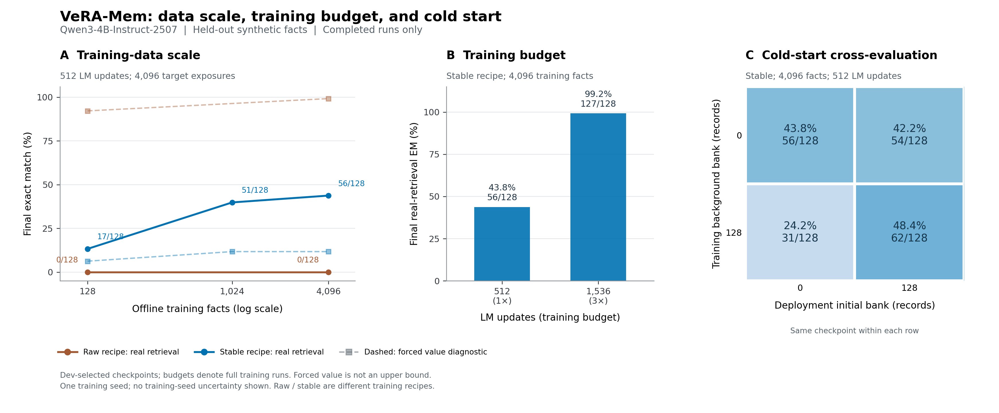

# VeRA-Mem 扩样、稳定训练和冷启动：学生交接说明

后续更新：已完成[数据增强与一致性训练的独立泛化对照](generalization_results.md)。本页保留扩样/冷启动实验的历史协议和结果，不与新协议混合统计。

实验日期：2026-10-05。基座为固定版本的 Qwen3-4B-Instruct-2507，训练/推理在 H100 上完成。本页对应已完成的扩样实验；逐项数字、严格配对区间与来源 hash 见[完整汇总](results/scaling/report.md)，机器可读结果见[summary.json](results/scaling/summary.json)。上一轮失败记录保留在[初步报告](pilot_results.md)。

## 目前得到的结论

**用户定义的 VDB 向量参数记忆闭环，在同模板的受控新事实任务上已经成立。** 稳定版使用 4,096 条离线训练事实和 1,536 次 batch-8 LM 更新，在 128 个未见实体上先提问、再接收观测并写入 VDB，最终答对 **127/128（99.2%）**。同一个模型和数据库只置换 value 后为 **2/128**，关闭记忆增量为 **0/128**。线上没有更新基座或共享参数。

**尚未得到跨问法泛化。** 本轮所有配置在唯一的改写模板上都是 **0/128**，因此结果只能支持这个受控任务中的读写机制，不能宣传为通用会话记忆、开放领域知识学习或长期持续学习系统已经解决。



## 实际实现的机制

插入点是 Qwen 的零起算 `layer=20`、`mlp.down_proj`，输入维度 9728、输出维度 2560，VeRA rank 与 key 维度均为 64。对 **每个实际 prompt/decode token 的该层输入** `x_t`，执行：

```text
q_t = normalize(Wq · normalize_query(x_t))
I_t = top4_cosine(q_t, VDB.keys)
v_t = Σ softmax(score[I_t] / temperature)_i · VDB.values_i
y_t = W x_t + b ⊙ B[(A x_t) ⊙ v_t]
```

因此取回的 `v_t` 是 VeRA 的动态 rank 缩放参数，条件有效矩阵为 `W + diag(b) B diag(v_t) A`。VDB 不返回文本进入 prompt；读取时不使用正确记录 ID。CPU reference store 全量算 cosine，再稀疏混合 top-4 value，查询成本仍随记录数增长，不是已经验证的大规模 ANN 服务。

完整新观测先通过冻结基座，取同层输入 `h`，然后生成并持久化：

```text
key_new   = normalize(Wk · normalize_support(h))
value_new = RMSNormalize(Wv · normalize_support(h))
VDB.upsert(record_id, timestamp, key_new, value_new)
```

读取期间数据库快照不变；观测揭示之后才写入。记录 ID 仅用于维护与评测审计。特征提取关闭记忆增量；单层适配使该层输入不依赖自身 adapter。离线训练约 187 万个共享参数 `Wq/Wk/Wv/b`；Qwen 和随机 `A/B` 固定。线上前向写入向量会改变后续条件参数，但不等同于推理期 SGD/TTT。

完整接口、时序和训练/部署状态见[向量记忆契约](vector_memory_contract.md)。

## 为什么不能只加数据或只填充初始库

旧版共有方向占 support 归一化特征能量约 99.54%：由[保存的中心范数](results/diagnostics/centered_vectors.json) `98.4022293` 与每条 RMS-normalized 输入平方范数 `9728` 计算，`98.4022293² / 9728 ≈ 0.995374`。`tanh` 曾把所有 value 压成相同向量。新稳定版分别用训练 query/support 的固定中心做中心化后重新 RMS 归一化；value 使用线性投影后 RMSNorm。统计从未用 dev/test 拟合，也不在线更新。单坐标可以超过 1，因此不能再用 `abs(value)>0.999` 解释成饱和。

另外修正了训练流程：先对齐 query/key，再训练正确 value 的 reader，随后使用真实 top-4 检索共同训练，包含答案预测位置的寻址损失。共享 b 的学习率从旧配方 0.03 降到 0.005，writer 从 0.001 降到 0.0001；真实检索阶段的地址学习率为 0.00001。温度由旧配方 0.2 改为 0.05。**这是组合配方改进，不能单独归因于去除 tanh。**

对线性探针的独立 CPU 诊断也表明：训练 128 条 support 特征后可在 dev64 解出 63 个答案，训练 4,096 条后为 64/64；query 特征分别只有 4/64、6/64。观测输入已经包含答案信息，主要困难不能简单归咎于基座没有编码答案。这个额外监督分类头只是信息诊断，不能把它的成绩算成 VDB–VeRA 成绩。[探针记录](results/scaling_diagnostics/feature_probe.json)

## 数据与公平性

训练集是严格嵌套且答案平衡的 128/1024/4096 条随机实体—单词关联；答案来自 16 个常用词。开发 64 条、在线新事实 128 条、未观测 control 64 条，实体完全隔离。Smoke 使用另外的种子和实体，不参与结果选择。所有正式配置共享同一测试实体、答案、模型、源码及特征缓存。

- 主规模矩阵：512 次 batch-8 LM 更新，共 4,096 次目标事实曝光。小集重复 32 遍，中集 4 遍，大集 1 遍。
- 地址预热单独计算：400 次、每次 128 对，共 51,200 对曝光。不能只报告 LM 数量来隐去该阶段。
- 稳定版课程：前 256 次 LM 更新强制正确 value，后 256 次真实检索。旧配方全程强制正确 value，地址固定。
- 延长训练：4,096 条事实不变，1,536 次 LM 更新、前后阶段各 768 次，共 12,288 次目标曝光；地址预热仍是 400 次。它比较额外训练预算，不是等 FLOPs 对照。
- checkpoint 只按开发集真实读取 NLL 选择。所有更新预算都会运行结束；部署所选 step 可能提前，完整表显式记录 selected step。
- 最终输出是 greedy 自由生成的完整答案 EM，最大 4 个新 token。预测和 gold-token NLL 分开记录；后者的 teacher forcing 不进入检索轨迹。

在扩样表中，同一测试事实逐条经历 `query-before-write → observation → encode/write → query-after-write`，然后在全部 128 次写入后测最终回忆、改写及控制。原始预测、配置、checkpoint、初始/最终 VDB、实际退出码和源码快照均已保存。

为避免反复运行冻结基座，本轮预先缓存了独立的 query/support 层输入。未来 support 缓存不参与训练统计、先前 query 或数据库；只在对应观测揭示的边界送入 writer 并写库。这验证因果数据流，但未把缓存准备算作在线写入延迟，因此不据此给出生产写入性能结论。

## 扩样和训练预算的结果

下表均为 128 条新事实的最终回忆；“强制正确 value”是辅助诊断，**不是数学上界**。对于真实检索训练过的模型，向所有 token 强制注入同一个正确 value 会改变读取分布，成绩可以低于真实路径。

| 配方 | 训练事实 | LM 更新预算 | 真实检索 | 强制正确 value | 置换 value | 零增量 |
| --- | ---: | ---: | ---: | ---: | ---: | ---: |
| 旧中心化/oracle 配方 | 128 | 512 | 0/128 | 118/128 | 0/128 | 0/128 |
| 旧中心化/oracle 配方 | 4096 | 512 | 0/128 | 127/128 | 0/128 | 0/128 |
| 稳定配方 | 128 | 512 | 17/128 | 8/128 | 0/128 | 0/128 |
| 稳定配方 | 1024 | 512 | 51/128 | 15/128 | 0/128 | 0/128 |
| 稳定配方 | 4096 | 512 | 56/128 | 15/128 | 0/128 | 0/128 |
| 稳定配方，延长训练 | 4096 | 1536 | **127/128** | 87/128 | 2/128 | 0/128 |

这使上一轮的解释更准确：128 条事实并不意味着 reader 完全没有表达能力；加大曝光后，旧配方正确 value 诊断已能达到 118/128。但旧配方的真实读取仍为零，说明单纯数据/预算增加不足以修复它的读取分布差距。

稳定配方在相同 LM 更新预算下从 17/128 增至 56/128，配对差值 **+30.47 个百分点**，事实 bootstrap 95% 区间 **[21.88, 39.06]**。1024 到 4096 的进一步收益较小；继续增加相同数据的训练预算后达到 127/128，支持“训练接口需要充分优化”这个判断，而不是必须先扩大到百万事实才能看到效果。

4096 条事实下，1536 与 512 次 LM 更新的配对差值为 **+55.47 pp，95% CI [46.09, 64.06]**；长训练的真实 value 相比置换 value 为 **+97.66 pp，[94.53, 100.00]**。

这些是一个训练种子的机制探索。bootstrap 仅反映固定模型、这组事实的抽样波动，不覆盖训练随机性、模板或开放任务的分布差异。

## 冷启动与协同训练必须一起解释

初始库由 **128 条离线训练观测经过学到的 writer** 生成；不含未来测试事实。带初始库训练的条件，在每个真实检索 episode 纳入相同背景记录并重新计算 key/value，按记录 ID 去重。这是学习后的事实库初始化，不是独立自由训练的 prototype 参数表。

固定 4096 条事实、512 次 LM 更新，分别比较训练和部署是否具有该库。同一行使用完全相同的 checkpoint：

| 训练时的背景库 | 部署空库 | 部署初始库128条 | 同权重部署差值 |
| --- | ---: | ---: | ---: |
| 无固定初始库 | 56/128 | 54/128 | −1.56 pp，95% CI [−3.91, 0.00] |
| 固定初始库128条 | 31/128 | 62/128 | +24.22 pp，95% CI [16.41, 32.03] |

**临时填库没有带来普遍收益；配套训练的模型会依赖其初始化分布。** 带库配方的 62/128 与无库配方的 56/128 同时改变了训练 episode 与部署环境，不能把这 6 题全部归给部署初始库，更不能把它和 1536 步长训练结果直接当等预算比较。

初始事实与新增事实只保存 float32 key64/value64，数值主体每条 512 bytes：128 条为 64 KiB，256 条为 128 KiB；不含 ID、元数据、共享 writer 或随机投影。该小库实验尚未验证百万规模检索、删除、冲突解析或无界容量。

## 尚未解决的问题与下一轮学生任务

延长训练后，同模板 prefill Recall@1/@4 均为 100%，decode 中正确记录出现在 top-4 的比例为 94.35%；128 条 value 均不同，有效秩约 9.79。这说明数值塌缩和同模板解码寻址已经明显改善。但换问法后的真实检索、强制正确 value 都仍为 0/128，真实 prefill top-4 仅命中 9/128。

decode 驻留率与准确率相关不等于单向因果：错误生成本身也会改变后续 query。这里不能单凭切换次数断定第一个答案 token 出错的原因。正确 value 诊断、逐位置可靠性门控及受控注入消融仍有价值。

建议学生按以下顺序继续，所有新增结果使用新的确认测试实体和至少三个独立训练种子：

1. **先补模板泛化。** 训练采用多个 query/support 模板，开发与测试保留未见模板；继续保留真实层输入查询、同 checkpoint 的 value 置换/零增量和严格读后写协议。不能把当前唯一改写模板反复当无偏测试集调参。
2. **再测容量与更新。** 扩大答案词表，引入多 token 答案、多关系、干扰观测和时间覆盖；记录旧事实保持、每次写入/查询成本和拒答。已有 ID 的 upsert 不自动解决文本实体消歧与矛盾检测。
3. **拆解组合配方。** 在固定数据和预算下，分别测试中心化、RMS value、地址学习率、温度、oracle→real 课程与按位置的记忆门控；当前结果不能说明每个组件独立有效。
4. **最后做真实任务外部验证。** 按已有[数据协议](data_protocol.md)迁移到 LongMemEval/LoCoMo 等完整会话划分，领域任务另做 MedMCQA。当前未知实体 control 不等于一般能力保持；需要常规任务/空读或无关记忆评估。

初始化与训练课程的文献依据见 [TTT 等方法的离线规模与初态](ttt_scaling_review.md)及 [Engram / Qwen3.8-Flash-Next 官方初始化核验](hash_initialization_review.md)。Hash 表与本项目语义 query 的地址机制不同，这些来源提供设计启发，不能代替本项目验证。

## 复现与产物

实现版本为代码提交 `0012cce`，实际运行源码以每个 suite 的快照和文件 SHA 为准。基座 revision：`cdbee75f17c01a7cc42f958dc650907174af0554`。测试环境见 [tested_environment.json](tested_environment.json)。完整测试 **88 项通过**，包括实际 hook、梯度、数据隔离、因果写入、检索轨迹和统计配对。

```bash
# 固定特征准备见 README；确保 GPU 当前空闲并替换 UUID。
python scripts/run_scaling_suite.py --workspace .. --gpu "$GPU_UUID" \
  --name reproduction_extended --profile extended \
  --cache ../data/scaling/features_v1.pt

# 汇总回传的运行记录，不加载大模型。
python scripts/summarize_scaling.py --runs-root ../runs/xtrah100 \
  --output docs/results/scaling
python scripts/plot_scaling.py --input docs/results/scaling/summary.json \
  --output-prefix docs/results/scaling/scaling_ablations
```

共完成 9 个正式训练/复评运行：7 次独立离线训练、2 次同 checkpoint 部署复评，另有独立 smoke 和固定特征准备。完整原始结果保存在项目本地备份，公开仓库只保存代码、研究说明和聚合结果，不放基座模型、设备连接配置或原始学生附件。
